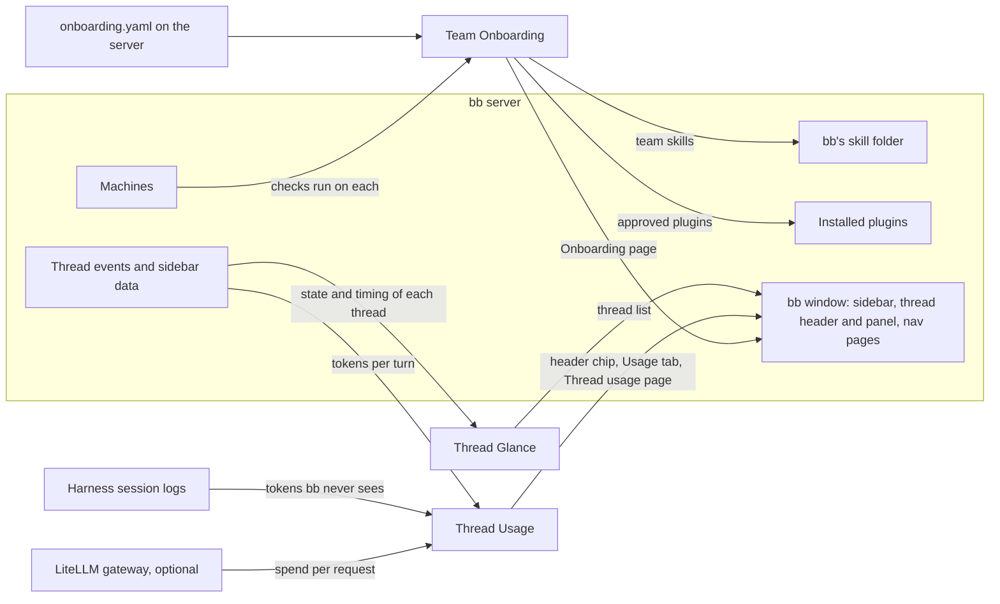

# bb plugins

Three plugins for [bb](https://getbb.app), each showing something bb's own interface does not. **Thread Glance** replaces the sidebar's thread list, so you can see which threads need you and what their child threads are doing without opening them. **Thread Usage** shows what a thread and every thread it spawned cost, in tokens and dollars, taking exact figures from a LiteLLM gateway when one sits in front of the models. **Team Onboarding** checks every machine against a setup your team writes down once, and fixes what it safely can. Each plugin installs on its own from this repository, and none depends on another: they share bb, not state.



The documentation starts at [docs/README.md](docs/README.md): tutorials for a first run of each plugin, how-to guides, reference and explanation.

| Plugin | What it does |
|---|---|
| [thread-glance](plugins/thread-glance) | Sidebar thread list that shows each thread's state, harness and child threads at a glance. |
| [thread-usage](plugins/thread-usage) | Cost, tokens and time of a thread and all the threads it spawned, from bb or from your AI gateway. |
| [team-onboarding](plugins/team-onboarding) | A live setup checklist from your team's manifest: GitHub over HTTPS or SSH, agent logins, skills, plugins and tools, checked and fixed on every machine. |

## Install

Install one plugin by name (`thread-glance`, `thread-usage` or `team-onboarding`):

```sh
bb plugin install git:https://github.com/gperezmz/bb-plugins.git@main --plugin thread-glance
```

[Install, update or remove a plugin](docs/how-to/install-plugins.md) covers pinning a release, updating and removing; [develop a plugin](docs/how-to/develop-plugins.md) covers running one from a checkout.

## Licence

MIT, see [LICENSE](LICENSE). Each plugin lists the third-party code it bundles in its `THIRD_PARTY_NOTICES.md`.
