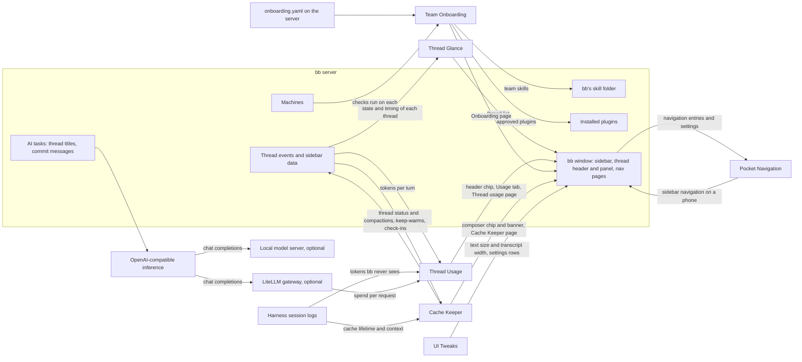

# bb plugins

Seven plugins for [bb](https://getbb.app). Three show something bb's own interface does not. **Thread Glance** replaces the sidebar's thread list, so you can see which threads need attention and what their child threads are doing without opening them. **Thread Usage** shows what a thread and every thread it spawned cost, in tokens and dollars, taking exact figures from a LiteLLM gateway when one sits in front of the models. **Team Onboarding** checks every machine against a setup your team writes down once, and fixes what it safely can. The fourth, **OpenAI-compatible inference**, lets bb title threads and write commit messages through a LiteLLM gateway or a local model, where bb's built-in Codex service needs a Codex login. The fifth, **Pocket Navigation**, draws bb's sidebar navigation on a phone as a New thread line above one row of icons, where bb's own takes six full-width rows. The sixth, **Cache Keeper**, keeps idle Claude Code threads cheap to come back to, by compacting them just before their prompt cache goes cold and keeping threads that wait on background work warm, wherever you switch it on. The seventh, **UI Tweaks**, adds appearance settings bb lacks: the size of the transcript and composer text, and the width of the transcript and composer columns, in thread views and on the New-thread screen. Each plugin installs on its own from this repository, and none depends on another: they share bb, not state.


```mermaid
flowchart LR
  subgraph bb["bb server"]
    events["Thread events and sidebar data"]
    machines["Machines"]
    skills["bb's skill folder"]
    installed["Installed plugins"]
    ui["bb window: sidebar, thread header and panel, nav pages"]
    helper["AI tasks: thread titles, commit messages"]
  end
  tg["Thread Glance"]
  tu["Thread Usage"]
  to["Team Onboarding"]
  oi["OpenAI-compatible inference"]
  gateway["LiteLLM gateway, optional"]
  localmodel["Local model server, optional"]
  logs["Harness session logs"]
  manifest["onboarding.yaml on the server"]
  events -->|state and timing of each thread| tg
  tg -->|thread list| ui
  events -->|tokens per turn| tu
  logs -->|tokens bb never sees| tu
  gateway -->|spend per request| tu
  tu -->|header chip, Usage tab, Thread usage page| ui
  manifest --> to
  machines -->|checks run on each| to
  to -->|team skills| skills
  to -->|approved plugins| installed
  to -->|Onboarding page| ui
  helper --> oi
  oi -->|chat completions| gateway
  oi -->|chat completions| localmodel
  pn["Pocket Navigation"]
  ui -->|navigation entries and settings| pn
  pn -->|sidebar navigation on a phone| ui
  ck["Cache Keeper"]
  events -->|thread status and background work| ck
  logs -->|cache lifetime and context| ck
  ck -->|compactions, keep-warms, check-ins| events
  ck -->|composer chip and banner, Cache Keeper page| ui
  ut["UI Tweaks"]
  ut -->|text size and transcript width, settings rows| ui
```

The documentation starts at [docs/README.md](docs/README.md): tutorials for a first run of each plugin, how-to guides, reference and explanation.

| Plugin | What it does |
|---|---|
| [thread-glance](plugins/thread-glance) | Sidebar thread list that shows each thread's state, harness and child threads at a glance. |
| [thread-usage](plugins/thread-usage) | Cost, tokens and time of a thread and all the threads it spawned, from bb or from your AI gateway. |
| [team-onboarding](plugins/team-onboarding) | A live setup checklist from your team's manifest: GitHub over HTTPS or SSH, agent logins, skills, plugins and tools, checked and fixed on every machine. |
| [openai-inference](plugins/openai-inference) | Thread titles and commit messages from a LiteLLM gateway or a local OpenAI-compatible server, in place of bb's built-in Codex service. |
| [pocket-navigation](plugins/pocket-navigation) | bb's sidebar navigation on a phone as a New thread line above one row of icons, in bb's own order and visibility. |
| [cache-keeper](plugins/cache-keeper) | Compacts idle Claude Code threads just before their prompt cache goes cold, keeps threads waiting on background work warm, and checks on stalled tasks, each only where you switch it on. |
| [ui-tweaks](plugins/ui-tweaks) | Text size, for the transcript and the composer, and transcript width, as two rows drawn like bb's Appearance settings; both reach the New-thread screen too. |

## Install

Install one plugin by name (`thread-glance`, `thread-usage`, `team-onboarding`, `openai-inference`, `pocket-navigation`, `cache-keeper` or `ui-tweaks`):

```sh
bb plugin install git:https://github.com/gperezmz/bb-plugins.git@main --plugin thread-glance
```

[Install, update or remove a plugin](docs/how-to/install-plugins.md) covers pinning a release, installing a prebuilt package from npm, updating and removing; [develop a plugin](docs/how-to/develop-plugins.md) covers running one from a checkout.

## Contributing

[CONTRIBUTING.md](CONTRIBUTING.md) covers pull requests, commit messages and releasing a plugin.

## Licence

MIT, see [LICENSE](LICENSE). Each plugin lists the third-party code it bundles in its `THIRD_PARTY_NOTICES.md`.
