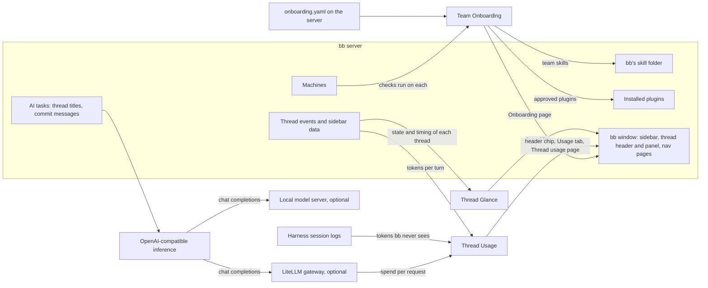

# bb plugins

Four plugins for [bb](https://getbb.app). Three show something bb's own interface does not. **Thread Glance** replaces the sidebar's thread list, so you can see which threads need attention and what their child threads are doing without opening them. **Thread Usage** shows what a thread and every thread it spawned cost, in tokens and dollars, taking exact figures from a LiteLLM gateway when one sits in front of the models. **Team Onboarding** checks every machine against a setup your team writes down once, and fixes what it safely can. The fourth, **OpenAI-compatible inference**, lets bb title threads and write commit messages through a LiteLLM gateway or a local model, where bb's built-in Codex service needs a Codex login. Each plugin installs on its own from this repository, and none depends on another: they share bb, not state.

The pages each plugin's behaviour rests on:

- [How the plugins fit into bb](explanation/how-the-plugins-fit-bb.md): where each part runs, what it stores, and the words the plugins share.
- [What "Needs attention" means](explanation/thread-glance-attention.md) in Thread Glance.
- [How Thread Usage counts tokens and cost](explanation/thread-usage-counting.md).
- [How Team Onboarding checks machines](explanation/team-onboarding-checks.md) without prompting, and why approvals happen only in the page.
- [How an AI task is sent](explanation/openai-inference-requests.md) by OpenAI-compatible inference, and how it asks for no reasoning.

## Map

**Tutorials** take you through a first run, start to finish.

- [Thread Glance: first run](tutorials/thread-glance-first-run.md)
- [Thread Usage: first run](tutorials/thread-usage-first-run.md)
- [Team Onboarding: first run and a first manifest](tutorials/team-onboarding-first-run.md)
- [OpenAI-compatible inference: first run](tutorials/openai-inference-first-run.md)

**How-to guides** do one job you already know you need.

- [Install, update or remove a plugin](how-to/install-plugins.md)
- [Develop a plugin from this repository](how-to/develop-plugins.md)
- [Switch the sidebar between Thread Glance and bb's list](how-to/thread-glance-switch-sidebar.md)
- [Connect a LiteLLM gateway for exact cost](how-to/thread-usage-connect-litellm.md)
- [Set price overrides and model aliases](how-to/thread-usage-set-prices.md)
- [Provision a manifest from a machine bootstrap](how-to/team-onboarding-provision-manifest.md)
- [Approve your team's commands](how-to/team-onboarding-approve-commands.md)
- [Title threads with a local model](how-to/openai-inference-local-server.md)

**Reference** lists every part, one entry each.

- [Thread Glance: states and glyphs](reference/thread-glance-states.md)
- [Thread Glance: preferences and `bb thread-glance prefs`](reference/thread-glance-preferences.md)
- [Thread Usage: settings](reference/thread-usage-settings.md)
- [Thread Usage: `bb thread-usage`](reference/thread-usage-cli.md)
- [Thread Usage: the `thread_usage` agent tool](reference/thread-usage-agent-tool.md)
- [Thread Usage: cost sources, prices, attribution and billing](reference/thread-usage-cost-sources.md)
- [Team Onboarding: settings](reference/team-onboarding-settings.md)
- [Team Onboarding: `bb team-onboarding`](reference/team-onboarding-cli.md)
- [Team Onboarding: items, statuses and safe fixes](reference/team-onboarding-items.md)
- [Team Onboarding: manifest](reference/team-onboarding-manifest.md)
- [OpenAI-compatible inference: endpoints, settings and failures](reference/openai-inference-settings.md)

**Explanation** says why things work the way they do.

- [How the plugins fit into bb](explanation/how-the-plugins-fit-bb.md)
- [What "Needs attention" means](explanation/thread-glance-attention.md)
- [How Thread Usage counts tokens and cost](explanation/thread-usage-counting.md)
- [How Team Onboarding checks machines](explanation/team-onboarding-checks.md)
- [How an AI task is sent](explanation/openai-inference-requests.md)
