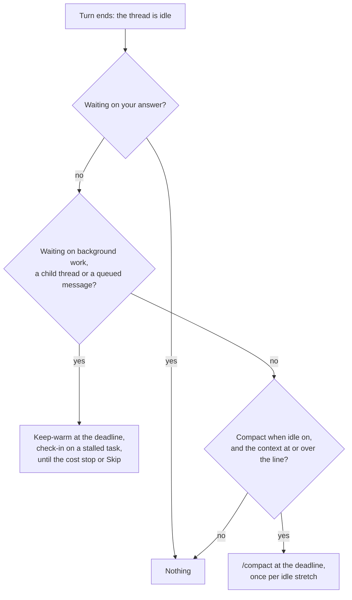

# When Cache Keeper acts

A Claude Code thread keeps its conversation in Anthropic's prompt cache for 5 minutes (an API key, or a subscription past its plan usage) or 1 hour (a subscription within plan usage). Come back after that and the first request writes the whole context into the cache again, at 1.25× the input price for 5 minutes or 2× for 1 hour, and every call after it reads the whole context back. Cache Keeper acts in the minute before that happens, and only then: once a thread's turn has ended, never while it works.

Source: [`src/core/keeper.ts`](../../plugins/cache-keeper/src/core/keeper.ts), with the pieces it rests on beside it in `src/core`.

## The deadline

Cache Keeper reads each thread's Claude Code transcript (`~/.claude/projects/<cwd slug>/<session id>.jsonl`) on the machine that runs it. The **cache lifetime** is what Anthropic applied to the most recent request that wrote to the cache: 5 minutes when it wrote `ephemeral_5m_input_tokens`, else 1 hour when it wrote `ephemeral_1h_input_tokens`. No setting overrides it, because managed settings, environment variables and plan overage can each change it.

The **deadline** is the most recent request's time, plus the cache lifetime, minus 60 seconds. Any request moves it, whoever caused it: your message, a child thread's report, a background task finishing, or Cache Keeper's own keep-warm or check-in. A deadline more than a minute past is not acted on, since the cache is already cold. That also covers a restart: what fell due while the bb server was down is not sent.

## The idle stretch

A thread's **idle stretch** starts when it turns idle and ends when it next becomes active for anything other than a message Cache Keeper sent. The turns Cache Keeper's own messages cause stay inside it. A thread is compacted at most once per idle stretch, Skip lasts until the stretch ends, and the cost stop counts what was spent in it.

## Waiting

A thread is **waiting** while it has a background command or subagent running, a queued or scheduled message, or a direct child thread that is still working or is itself waiting. A grandchild makes only its own parent wait; the grandparent waits on that child. A waiting thread is never compacted: something will wake it soon, and compacting then would throw away the context the report comes back to.

## The compaction line

Compacting costs one warm read of the context, C, and a summary of about S = 20,000 tokens written as output: r·C + o·S. Coming back to a cold cache without it costs a rewrite of the whole context and k reads of it on your first message back, where a compacted thread rewrites and reads only its post-compaction size P. The difference is (w + k·r)·(C − P).

The **compaction line** for setting N is the smallest C with

(w + k·r)·(C − P) ≥ N·(r·C + o·S)

| Symbol | What it is |
|---|---|
| w | The model's cache-write price at the thread's cache lifetime |
| r | The cache-read price |
| o | The output price |
| k | The thread's mean model requests per user message, from its own transcript; 3 before its first |
| P | The thread's size after its last compaction; 40,000 tokens when it has none |
| N | The setting, 1 to 10: how many times over the first message back must repay compacting |

When no context up to the model's window satisfies it, the line is "never". The popover shows the line as a size rather than N: you drag between the ten sizes it gives, or type one and it snaps. A thread switched on for the first time starts at the setting you chose last on any thread, or 2. The line counts only your first message back, with no guess at when you return: a thread you leave for a week and one you leave for an hour pay the same rewrite.

Prices come from LiteLLM's public list, then models.dev, then the LiteLLM list bundled with the plugin, fetched daily while [Fetch current prices daily](../reference/cache-keeper-settings.md) is on.

## Keep-warms and check-ins

While a waiting thread is idle, Cache Keeper sends it a **keep-warm** at its deadline: a one-line turn that refreshes the cache, so the report the thread waits on lands on a warm cache. A background command or subagent that has printed or progressed nothing for the no-output wait is a **stalled task**, and gets a **check-in**, a turn asking the agent to look at it and fix it if it is stuck. Each further check-in on a task that stays stalled waits twice as long as the one before. A task that keeps printing gets a routine check-in every 30 minutes of running, so a loop of repeated errors is caught too. A check-in restarts both of its task's clocks.

Each thread checks in only on its own background commands and subagents. A parent keeps itself warm for its children and never checks in on them: a child silent mid-turn cannot take a message.

Keep-warms and check-ins stop for the rest of the idle stretch once their estimated cost reaches the **cost stop**: what rewriting the thread's context cold would cost, w·C. A keep-warm is estimated at one cache read of the context; a check-in at the requests it caused in the transcript. A thread waiting only on a scheduled message due after the cost stop would be reached gets no keep-warms at all.

Every message is a fixed template, so the same state always sends the same words: [the messages](../reference/cache-keeper-settings.md#the-messages) lists them.
