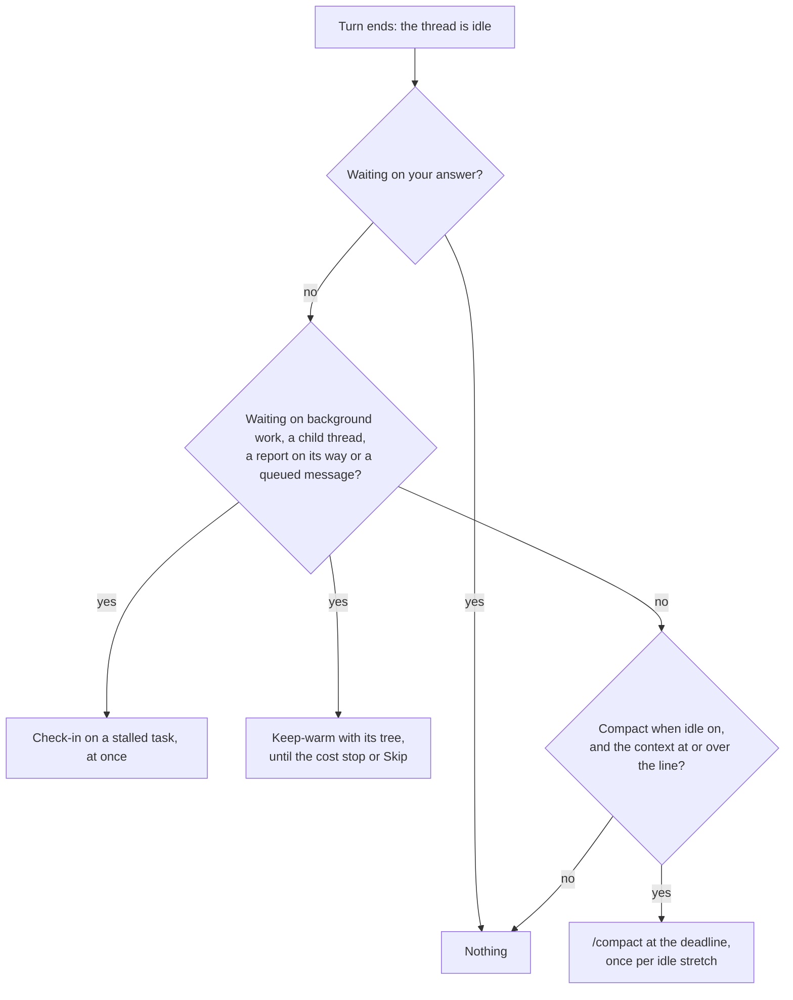
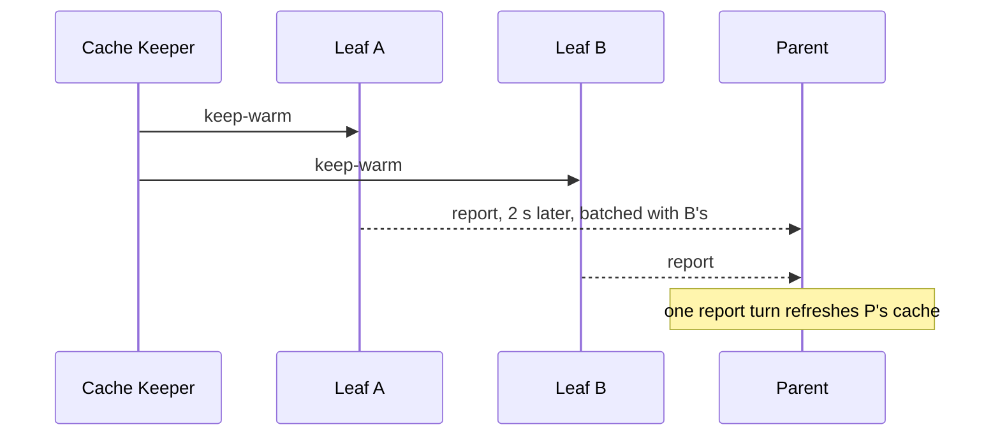

# When Cache Keeper acts

A Claude Code thread keeps its conversation in Anthropic's prompt cache for 5 minutes (an API key, or a subscription past its plan usage) or 1 hour (a subscription within plan usage). Come back after that and the first request writes the whole context into the cache again, at 1.25× the input price for 5 minutes or 2× for 1 hour, and every call after it reads the whole context back. Cache Keeper acts in the minute before that happens, and only then: once a thread's turn has ended, never while it works.

Source: [`src/core/keeper.ts`](../../plugins/cache-keeper/src/core/keeper.ts) for one thread, [`src/core/tree.ts`](../../plugins/cache-keeper/src/core/tree.ts) for a thread tree and [`src/core/turns.ts`](../../plugins/cache-keeper/src/core/turns.ts) for whose turn was whose, with the pieces they rest on beside them in `src/core`.

## The deadline

Cache Keeper reads each thread's Claude Code transcript (`~/.claude/projects/<cwd slug>/<session id>.jsonl`) on the machine that runs it. The **cache lifetime** is what Anthropic applied to the most recent request that wrote to the cache: 5 minutes when it wrote `ephemeral_5m_input_tokens`, else 1 hour when it wrote `ephemeral_1h_input_tokens`. No setting overrides it, because managed settings, environment variables and plan overage can each change it.

The **deadline** is the most recent request's time, plus the cache lifetime, minus 60 seconds. Any request moves it, whoever caused it: your message, a child thread's report, a background task finishing, or Cache Keeper's own keep-warm or check-in. A deadline more than a minute past is not acted on, since the cache is already cold. That also covers a restart: what fell due while the bb server was down is not sent.

## Whose turn it was

bb records every input it hands a thread, and which turn took it. A turn is a **Cache Keeper turn** when every input it took is a message Cache Keeper sent, or bb's **report** of a child thread's turn that was itself a Cache Keeper turn, at any depth. Anything else in the turn makes it real: a message you typed, even into a turn Cache Keeper started; a report of a child's turn that was real, failed or was interrupted; a turn with no input at all, which is Claude Code woken by a background task finishing. The answer comes from bb's event history alone, so it is the same after Cache Keeper or bb restarts.

bb 0.44 does not keep a plugin's `pluginSubmission` marker in that history, so Cache Keeper recognises its own messages by their fixed text, and a report's children by the thread mentions bb writes into it. A report held in a queue can arrive after its child has run further turns, so a report line stands for every turn the child ended since its previous report, and counts as Cache Keeper's only when all of them do.

## The idle stretch

A thread's **idle stretch** starts when it turns idle and ends when a real turn starts. Cache Keeper turns stay inside it, and so do the report turns they cause in the threads above. A thread is compacted at most once per idle stretch, Skip lasts until the stretch ends, and the cost stop counts what was charged in it. Cache Keeper turns are also left out of the calls per message the compaction line rests on.

## Waiting

A thread is **waiting** while it has a background command or subagent running, a queued or scheduled message, or a direct child thread that is still working or is itself waiting. A grandchild makes only its own parent wait; the grandparent waits on that child. A parent also waits from the moment a child's turn ends until bb's report of it has arrived, at most two minutes, since bb holds reports back two seconds to batch them. A waiting thread is never compacted: something will wake it soon, and compacting then would throw away the context the report comes back to.

## The compaction line

Compacting costs one warm read of the context, C, and a summary of about S = 20,000 tokens written as output: r·C + o·S. Coming back to a cold cache without it costs a rewrite of the whole context and k reads of it on your first message back, where a compacted thread rewrites and reads only its post-compaction size P. The difference is (w + k·r)·(C − P).

The **compaction line** for setting N is the smallest C with

(w + k·r)·(C − P) ≥ N·(r·C + o·S)

| Symbol | What it is |
|---|---|
| w | The model's cache-write price at the thread's cache lifetime |
| r | The cache-read price |
| o | The output price |
| k | The thread's mean model requests per user message, from its own transcript, leaving out Cache Keeper's own turns; 3 before its first message |
| P | The thread's size after its last compaction; 40,000 tokens when it has none |
| N | The setting, 1 to 10: how many times over the first message back must repay compacting |

When no context up to the model's window satisfies it, the line is "never". The popover shows the line as a size rather than N: you drag between the ten sizes it gives, or type one and it snaps. A thread switched on for the first time starts at the setting you chose last on any thread, or 2. The line counts only your first message back, with no guess at when you return: a thread you leave for a week and one you leave for an hour pay the same rewrite.

Prices come from LiteLLM's public list, then models.dev, then the LiteLLM list bundled with the plugin, fetched daily while [Fetch current prices daily](../reference/cache-keeper-settings.md) is on.

## Keeping a thread tree warm

bb reports every turn a child thread ends to its parent, and the parent's turn on that report refreshes its cache, whoever started the child's turn. A keep-warm sent to a waiting thread at the bottom of a **thread tree** therefore keeps every waiting thread above it warm too. Cache Keeper sends keep-warms only to those leaves, all at once, as one **tree keep-warm**, so the reports climb and each thread above takes one batched report turn per cycle rather than one per child.

The tree keep-warm goes at the earliest deadline among the tree's waiting threads, less a lead of 60 seconds and 30 more for each level between the top-level thread and the deepest leaf in the send, so the reports reach the top before any cache there expires. It goes to every waiting leaf whose deadline would not wait for the next one, so after one cycle all the leaves go together. The deepest leaves go first; a shallower leaf goes when the report from below reaches its level, or 30 seconds a level later if none has, so that its turn and the report's run side by side and bb batches both into the parent. With 5-minute caches and one level, that is every 150 seconds; a 1-hour parent over a 5-minute child takes a report turn each time and no turn of its own.

A thread whose cache no request refreshed by its own deadline, because a report came late or never, gets its own keep-warm then. A send or report still on its way holds the tree's next send until it lands. Sends go at their moment: between its passes over every tree, Cache Keeper wakes for the next send due and reads only the trees it concerns.

A keep-warm is unconditional: it tells the agent there is nothing to check and asks for the **nothing-new reply** "Not finished yet, still waiting on … Nothing needed from you.", worded so that bb's "completed" report of it does not read as news to the parent.

## Check-ins

A background command or subagent that has printed or progressed nothing for the no-output wait is a **stalled task**. The thread that owns it, at any depth, gets a **check-in** within a few seconds, or as soon as its turn ends if it was working: a turn asking the agent to look at the task and fix it if it is stuck. Each further check-in on a task that stays stalled waits twice as long as the one before. A parent never checks in on its children's tasks: only the thread running a task can see it stuck.

A task that keeps printing gets no turn of its own. Once it has run 30 minutes, and every 30 minutes after, the thread's next keep-warm also asks the agent to look at it. Such a keep-warm, like a check-in, asks for the nothing-new reply "Checked {tasks}, still running normally, nothing new. Nothing needed from you.", which Cache Keeper recognises by its shape: it starts "Checked", names every task asked about and ends "nothing new. Nothing needed from you."

## The cost stop

Every Cache Keeper turn is charged at its real cost, read from the thread's transcript at the model's prices, and so is every report turn it forced in the threads above. A report turn that batched several leaves is split equally between them. What a thread's keep-warms and check-ins were charged in its idle stretch is kept across restarts.

A thread's keep-warms stop once that charge, plus the forecast of its next keep-warm and the turns it would force above, would pass its **cost stop**: one cold rewrite of its own context at its own cache lifetime's write price. The forecast is what its last keep-warm cost; before one is measured, it is a cache read of its context and of each waiting context above it. With a 1-hour parent over a 5-minute child of similar size, each child keep-warm costs about two reads against one 5-minute write of the child, so they stop within the child's first hour. A thread waiting only on a scheduled message due after the cost stop would be reached gets no keep-warms at all.

Skip, and a thread's cost stop, apply to every thread below it for the rest of the wait. Check-ins on a stalled task go anyway: each thread owns its background work and only it can notice it stuck. Past the cost stop the cache is cold, so the Cache Keeper page shows such a check-in at the cold-write price, while its real cost still counts towards the stretch.

## Read state

bb marks a thread read when a plugin sends to it, and draws attention to a top-level thread whose turn ends. Left alone, every keep-warm would leave its tree unread and in Thread Glance's Needs attention. After a Cache Keeper turn whose replies, and the replies of every child turn it reports, are nothing-new replies, Cache Keeper puts the thread's read state back to what it was before the turn's first input: read stays read, unread stays unread. If you changed the read state meanwhile, it is left as you set it, even where the turn's end then drew bb's attention to the thread. A turn that brought news stays as bb set it.

While a thread waits on your answer, bb queues its reports instead of delivering them. Queued report rows whose every line reports a turn that brought nothing new are deleted, and never make the thread count as waiting.

Every message is a fixed template, so the same state always sends the same words: [the messages](../reference/cache-keeper-settings.md#the-messages) lists them.
