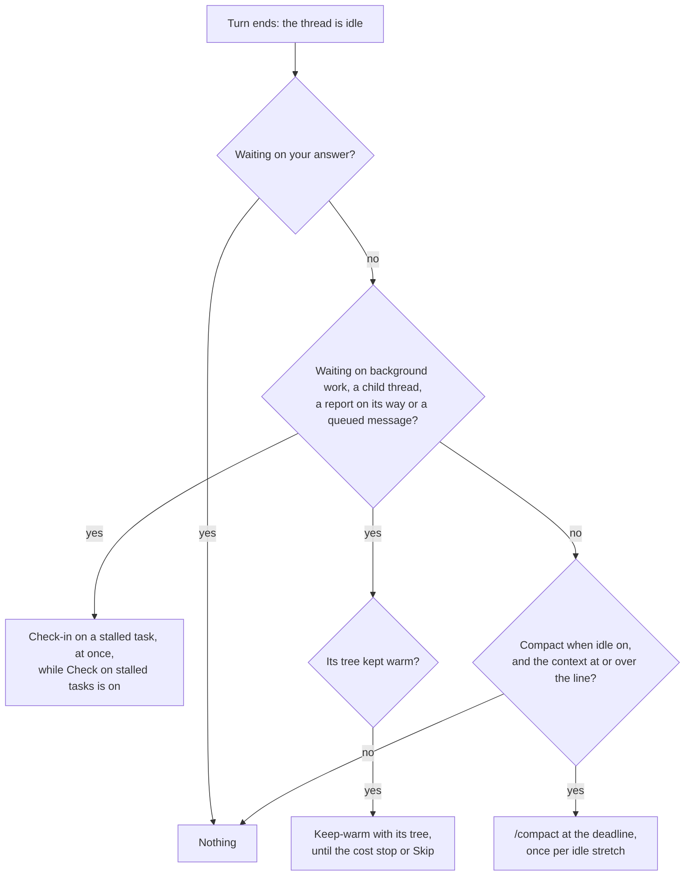
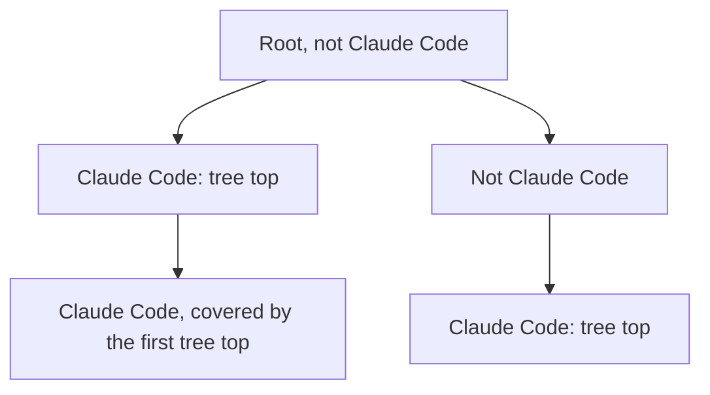
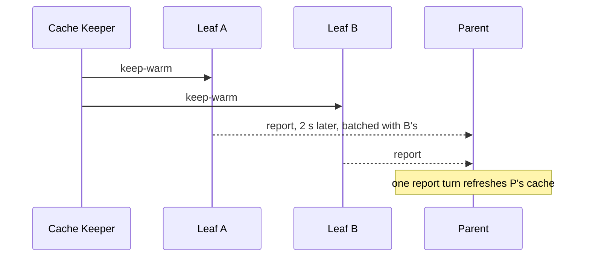

# When Cache Keeper acts

A Claude Code thread keeps its conversation in Anthropic's prompt cache for 5 minutes (an API key, or a subscription past its plan usage) or 1 hour (a subscription within plan usage). Come back after that and the first request writes the whole context into the cache again, at 1.25× the input price for 5 minutes or 2× for 1 hour, and every call after it reads the whole context back. Cache Keeper acts in the minute before that happens, and only then: once a thread's turn has ended, never while it works.

Source: [`src/core/keeper.ts`](../../plugins/cache-keeper/src/core/keeper.ts) for one thread, [`src/core/tree.ts`](../../plugins/cache-keeper/src/core/tree.ts) for a thread tree and [`src/core/turns.ts`](../../plugins/cache-keeper/src/core/turns.ts) for whose turn was whose, with the pieces they rest on beside them in `src/core`; [`src/server/engine.ts`](../../plugins/cache-keeper/src/server/engine.ts) for when it learns and acts.

## How Cache Keeper learns and wakes

Cache Keeper runs on bb's events. It keeps what it knows of each thread in memory: status, parent, harness, archived or deleted, queued work and pending interaction, from bb's `thread.*`, `interaction.pending` and `message.*` events. Only a thread's end of turn (idle or failed; a failed turn counts as a turn end) makes it read anything: the events bb added to that thread since the position it saved, and, where the thread's deadline matters, its transcript from the byte it last read to. Then it plans that thread's tree and sets one timer for whatever falls due first. Nothing runs between due times but these:

| Timer | When |
|---|---|
| The reconciliation check | Every 5 minutes, give or take 30 seconds: one listing of bb's threads, which corrects anything a missed event left wrong, such as a queued row bb announced to no one |
| The host keep-alive | Every 4 minutes while a deadline or stall check is pending on a machine, so its host worker stays loaded |
| The nightly prune | Once a night, of history and sends older than 90 days |
| The price refresh | Once a day while [Fetch current prices daily](../reference/cache-keeper-settings.md#settings) is on |

The saved positions survive a restart of bb, the daemon or the plugin. A reinstall keeps them too, but [switches everything off](../reference/cache-keeper-settings.md#after-a-reinstall). After a restart Cache Keeper lists bb's threads once, catches up only the threads bb updated since it last looked (less a minute's margin), each from its saved position, and sets its timer from the facts it stored. No transcript is read from its start again unless it became another file, or a new Claude Code session (bb starts one on `/clear`), whose transcript is read from then on and whose old facts no longer count.

A surface asking for a thread (the composer chip, the banner, `status`) is answered from memory; a thread it has never read is read alone. A machine that does not answer within 10 seconds holds only the threads it runs.

## The deadline

Cache Keeper reads each thread's Claude Code transcript (`~/.claude/projects/<cwd slug>/<session id>.jsonl`) on the machine that runs it. The **cache lifetime** is what Anthropic applied to the most recent request that wrote to the cache: 5 minutes when it wrote `ephemeral_5m_input_tokens`, else 1 hour when it wrote `ephemeral_1h_input_tokens`. No setting overrides it, because managed settings, environment variables and plan overage can each change it.

The **deadline** is the most recent request's time, plus the cache lifetime, minus 60 seconds. Any request moves it, whoever caused it: your message, a child thread's report, a background task finishing, or Cache Keeper's own keep-warm or check-in. A deadline more than a minute past is not acted on, since the cache is already cold. That also covers a restart, a machine that slept and a timer that stalled: what fell due meanwhile is not sent, and Cache Keeper plans again from what it knows now.

## Whose turn it was

bb records every input it hands a thread, and which turn took it. A turn is a **Cache Keeper turn** when every input it took is a message Cache Keeper sent, or bb's **report** of a child thread's turn that was itself a Cache Keeper turn, at any depth. Anything else in the turn makes it real: a message you typed, even into a turn Cache Keeper started; a report of a child's turn that was real, failed or was interrupted; a turn with no input at all, which is Claude Code woken by a background task finishing, or a turn a background task finished during, since Claude Code takes the finished task into it. The answer comes from bb's event history alone, so it is the same after Cache Keeper or bb restarts.

bb 0.44 does not keep a plugin's `pluginSubmission` marker in that history, so Cache Keeper recognises its own messages by their fixed text. It recognises a report by the fields bb records on it: `initiator` is `system` and `systemMessageKind` is one of the `child-*` kinds. A single report names its child in `systemMessageSubject`; a batched one names each child of the thread it mentions. A report of a child that failed, was interrupted or needs your attention makes the turn real. Every other line is judged by the child's own turn history, including how the child's turn ended, never by the report's text. A system message whose kind is missing or unknown is taken as real, and Cache Keeper writes a warning to the plugin log; so does a report that names no child.

A report held in a queue can arrive after its child has run further turns, so a report line stands for every turn the child ended since its previous report, and counts as Cache Keeper's only when all of them do. While a thread waits on your answer, bb shows its reports as queued rows, which carry no kind. There Cache Keeper tells a report by its `[bb system]` text and its mentions of the thread's children, and judges each child by its own turn history as above.

## The idle stretch

A thread's **idle stretch** starts when it turns idle and ends when a real turn starts. Cache Keeper turns stay inside it, and so do the report turns they cause in the threads above. A thread is compacted at most once per idle stretch, Skip lasts until the stretch ends, and the cost stop counts what was charged in it. Cache Keeper turns are also left out of the calls per message the compaction line rests on.

## Waiting

A thread is **waiting** while it has a background command or subagent running, a queued or scheduled message, or a direct child thread that is still working or is itself waiting. A grandchild makes only its own parent wait; the grandparent waits on that child. A parent also waits from the moment a child's turn ends until bb's report of it has arrived, at most two minutes, since bb holds reports back two seconds to batch them. A waiting thread is never compacted: something will wake it soon, and compacting then would throw away the context the report comes back to.

## The compaction line

Compacting costs one warm read of the context, C, and a summary of about S = 20,000 tokens written as output: r·C + o·S. Coming back to a cold cache without it costs a rewrite of the whole context and k reads of it on your first message back, where a compacted thread rewrites and reads only its post-compaction size P. The difference is (w + k·r)·(C − P).

The **compaction line** for setting N is the smallest C with

(w + k·r)·(C − P) ≥ N·(r·C + o·S)

| Symbol | What it is |
|---|---|
| w | The model's cache-write price at the thread's cache lifetime |
| r | The cache-read price |
| o | The output price |
| k | The thread's mean model requests per user message, from its own transcript, leaving out Cache Keeper's own turns; 3 before its first message |
| P | The thread's size after its last compaction; 40,000 tokens when it has none |
| N | The setting, 1 to 10: how many times over the first message back must repay compacting |

The window is the one bb reports for the thread, which it learns at the end of the thread's first turn; there is no default, so until bb reports it the thread has no lines, and `--above` is refused. The model's listed maximum is not used: a thread can run below it. When no context up to the window satisfies it, the line is "never". When a thread's model changes and its window with it, a setting whose line no longer fits shows as "never" and is kept. The composer chip's popover shows the line as a size rather than N: you drag between the ten sizes it gives, or type one and it snaps. A thread switched on for the first time starts at the setting you chose last on any thread, or 2. The line counts only your first message back, with no guess at when you return: a thread you leave for a week and one you leave for an hour pay the same rewrite.

Prices come from LiteLLM's public list, then models.dev, then the LiteLLM list bundled with the plugin, fetched daily while [Fetch current prices daily](../reference/cache-keeper-settings.md#settings) is on.

## Which trees are kept warm

**Keep warm while waiting** is a switch on each **tree top**: a Claude Code thread with no Claude Code thread above it. It covers the tree top and every Claude Code thread below it, including threads spawned after it was set. A tree whose root is not a Claude Code thread has one tree top per Claude Code branch, each switched on its own, since only Claude Code threads have the composer chip and get keep-warms. An archived or deleted thread ends its tree, as it does for tree keep-warms: archive a tree top and each Claude Code thread below it that has no other Claude Code thread above it becomes a tree top of its own, with its switch untouched.

A tree top nobody has flipped follows the "Keep caches warm while waiting" [setting](../reference/cache-keeper-settings.md#settings): on under `Every waiting thread`, off under `Only threads switched on`, the default. Flipping it records on or off on the tree top, which decides from then on under either value, across restarts, until it is flipped again. Under `Never` no tree is kept warm whatever its tree top records, and switching back restores each record. The switch is set on the tree top rather than per thread because a tree is kept warm as one: a keep-warm below forces report turns in every thread above.

A tree not kept warm gets no keep-warms, so nothing is charged to it but its check-ins, which go [as below](#check-ins) either way.

## Keeping a thread tree warm

bb reports every turn a child thread ends to its parent, and the parent's turn on that report refreshes its cache, whoever started the child's turn. A keep-warm sent to a waiting thread at the bottom of a **thread tree** therefore keeps every waiting thread above it warm too. Cache Keeper sends keep-warms only to those leaves, all at once, as one **tree keep-warm**, so the reports climb and each thread above takes one batched report turn per cycle rather than one per child.

A leaf's keep-warm goes at its own deadline, or earlier where a waiting thread above it would reach its deadline first: at that thread's deadline less 60 seconds and 30 more for each level between them, so the report climbs to it in time. Once the tree is aligned, the reports refresh the threads above a few seconds after their leaves, so their deadlines trail the leaves' and the tree cycles about once per cache lifetime less the minute's margin: every 240 seconds on 5-minute caches, every 59 minutes on 1-hour ones. Every leaf whose keep-warm could not wait for the tree's next one goes with this one, so after one cycle all the leaves go together. The deepest leaves go first; a shallower leaf goes when the report from below reaches its level, or 30 seconds a level later (never more than 30 seconds past its own deadline) if none has, so that its turn and the report's run side by side and bb batches both into the parent. A 1-hour parent over a 5-minute child takes a report turn each time and no turn of its own.

A thread whose cache no request refreshed by its own deadline, because a report came late or never, gets its own keep-warm then; while a send or report is still climbing to it, it waits up to 30 seconds more for it, inside the minute the deadline leaves. A send or report still on its way holds the tree's next send until it lands. Sends go at their moment, within a second of it.

A keep-warm is unconditional: it tells the agent there is nothing to check and asks for the **nothing-new reply** "Not finished yet, still waiting on … Nothing needed from you.", worded so that bb's "completed" report of it does not read as news to the parent.

## Check-ins

Check-ins run only while "Check on stalled tasks", in the [Stalled tasks section](../reference/cache-keeper-settings.md#settings) of Cache Keeper's settings with the no-output wait, is on, which it is not on a fresh install; switched on, they go to every Claude Code thread. A background command or subagent that has printed or progressed nothing for the no-output wait is a **stalled task**. The thread that owns it, at any depth, gets a **check-in** at that moment, whether or not its tree is kept warm and whatever the keep-warm setting, or as soon as its turn ends if it was working: a turn asking the agent to check the task and report what it finds, and saying that a task quiet on purpose, such as a server or a watcher, is fine to leave running. It never tells the agent to stop, kill or restart anything. Just before it goes, Cache Keeper reads the task's latest output or progress, so a task that printed since is not asked about. Each further check-in on a task that stays stalled waits twice as long as the one before, and the spacing starts again only once the task prints or progresses again. A parent never checks in on its children's tasks: only the thread running a task can see it stalled.

A task that keeps printing gets no turn of its own. Once it has run 30 minutes, and every 30 minutes after, the thread's next keep-warm also asks the agent to look at it. With "Check on stalled tasks" off, no check-in goes, and no keep-warm asks about a task. Such a keep-warm, like a check-in, asks for the nothing-new reply "Checked {tasks}, still running normally, nothing new. Nothing needed from you.", which Cache Keeper recognises by its shape: it starts "Checked", names every task asked about and ends "nothing new. Nothing needed from you."

## The cost stop

Every Cache Keeper turn is charged at its real cost, read from the thread's transcript at the model's prices, and so is every report turn it forced in the threads above. A report turn that batched several leaves is split equally between them. What a thread's keep-warms and check-ins were charged in its idle stretch is kept across restarts.

A thread's keep-warms stop once that charge, plus the forecast of its next keep-warm and the turns it would force above, would pass its **cost stop**: one cold rewrite of its own context at its own cache lifetime's write price. The forecast is what its last keep-warm cost; before one is measured, it is a cache read of its context and of each waiting context above it. With a 1-hour parent over a 5-minute child of similar size, each child keep-warm costs about two reads against one 5-minute write of the child, so they stop within the child's first hour. A thread waiting only on a scheduled message due after the cost stop would be reached gets no keep-warms at all.

The cost stop fails closed. A thread whose model has no price, or whose price has no cache read or cache write rate at its cache lifetime, or one of 0, gets no keep-warm, and its composer chip and `status` say keep-warms are held because the model has no price. A fetched price of 0 is taken as the list's mistake, and the next list is used. A keep-warm whose turn's cost cannot be read from the transcript, or whose turn never came, is charged its forecast, so the cost stop comes however many turns go unmeasured.

Skip, and a thread's cost stop, apply to every thread below it for the rest of the wait. Check-ins on a stalled task go anyway: each thread owns its background work and only it can notice it stalled. Past the cost stop the cache is cold, so the Cache Keeper page shows such a check-in at the cold-write price, while its real cost still counts towards the stretch.

## Read state

bb marks a thread read when a plugin sends to it, and draws attention to a top-level thread whose turn ends. Left alone, every keep-warm would leave its tree unread and in Thread Glance's Needs attention. After a Cache Keeper turn whose replies, and the replies of every child turn it reports, are nothing-new replies, Cache Keeper puts the thread's read state back to what it was before the turn's first input: read stays read, unread stays unread. If you changed the read state meanwhile, it is left as you set it, even where the turn's end then drew bb's attention to the thread. A turn that brought news stays as bb set it.

While a thread waits on your answer, bb queues its reports instead of delivering them. Queued report rows whose every line reports a turn that brought nothing new are deleted, and never make the thread count as waiting.

Deleting such a row, and putting a read state back, each write a history row naming the thread.

Every message is a fixed template, so the same state always sends the same words: [the messages](../reference/cache-keeper-settings.md#the-messages) lists them.

## Before every send

Immediately before every automatic send (a keep-warm, a check-in, or `/compact` at a thread's deadline), Cache Keeper reads the thread afresh from bb rather than from its memory, and sends only if it is still idle (bb leaves a thread whose last turn failed in `error`, which counts as idle), not archived and not deleted, a Claude Code thread, with no pending interaction, and still switched on for what is being sent: Compact when idle for `/compact`, its tree kept warm for a keep-warm, check-ins on for a check-in. Otherwise nothing is sent, and the reason goes in history.

It sends with bb's `mode: "start"`, which bb refuses on a thread that has become busy: that counts as the thread becoming busy, and that due time is not tried again. A send that fails any other way gives up its claim and is logged as a warning, and Cache Keeper sends that thread nothing for a minute; whatever is still due after that minute goes then. Each send is claimed for its thread and due time before it goes, so two never both go, even after a restart during a send, or when a compaction at the deadline and **Compact now** fall due at once. A reply from bb or a machine that lacks a field Cache Keeper acts on counts as "don't act" for that thread; a missing pending interaction counts as one. A switch you flip while Cache Keeper waits on bb or a machine always holds.

## Why nothing was sent

Each decision to send, and each time a send that fell due is held back, is written to the plugin log (`bb plugin logs cache-keeper`) at `info`, with the thread, what was due and the reason, and never any message or transcript text. `bb cache-keeper status <thread>` shows the thread's last decision and its reason.

| Reason | Held back because |
|---|---|
| cost stop | The next keep-warm would pass the thread's [cost stop](#the-cost-stop) |
| no price | The model has no price, or no usable cache rate |
| thread busy | The thread is working, or bb refused the send as busy |
| pending interaction | The thread waits on your answer |
| switched off | Compact when idle, its tree's Keep warm while waiting, or Check on stalled tasks is off |
| skipped | Skip was pressed |
| Never | The thread's line is "never", or keep-warms are set to `Never` |
| archived, deleted | bb archived or deleted the thread |
| not a Claude Code thread | The thread runs another harness |
| missing field | A reply from bb lacked a field Cache Keeper acts on |
| already sent | A send for that thread and due time was already claimed |
| host offline | The machine running the thread did not answer |
| transcript unreadable | The thread's transcript cannot be read or parsed; `status` says so, and the log once |
| window unknown | bb has not reported the thread's context window yet |
