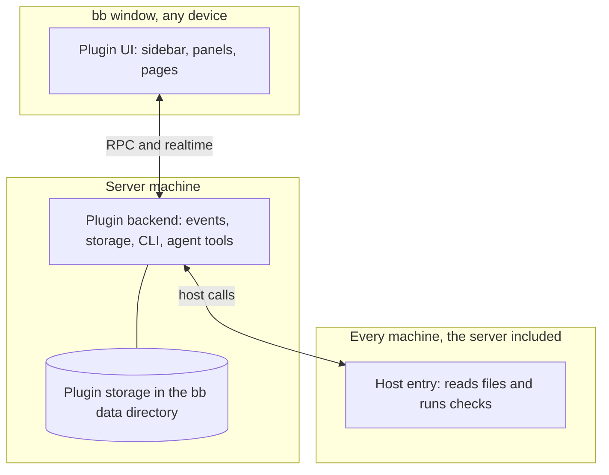

# How the plugins fit into bb

Each plugin is an ordinary bb plugin: a folder under `plugins/` with its own `package.json`, listed in [`.bb/plugins.json`](../../.bb/plugins.json) so `bb plugin install --plugin <name>` can pick it out of this repository. They share no code at run time and do not know about each other.

## Where each part runs

A bb plugin can have up to three parts, and the plugins use them differently.

| Plugin | Backend | UI | Host entry |
|---|---|---|---|
| Thread Glance | Stamps thread start, finish and wait times; keeps preferences; serves `bb thread-glance` | The sidebar thread list | none |
| Thread Usage | Builds the ledger from bb's events, sweeps the gateway, prices turns; serves `bb thread-usage` and the `thread_usage` tool | Header chip, Usage tab, Thread usage page, settings section | Reads harness session logs on the machine that ran a thread |
| Team Onboarding | Reads the manifest, schedules checks, syncs skills, installs approved plugins; serves `bb team-onboarding` | Onboarding page, sidebar badge, home **Setup** line, **Team manifest** tab | Runs the checks and fixes on each machine |
| OpenAI-compatible inference | Registers an AI service per Endpoint, and reports whether each is ready; sends the Endpoints to the host entry | none | Sends bb's AI tasks to the Endpoints, from the primary machine |
| Pocket Navigation | none | The sidebar navigation | none |

The **server machine** is the machine that runs the bb server and holds its data directory (`bb status` prints it as `Data dir`, for example `/var/lib/bb/.bb` on a server where bb runs as a service user). Every machine, the server machine included, runs bb's daemon, and all are listed under Settings → Machines. A backend always runs on the server machine; a host entry runs in the daemon of whichever machine the backend calls.

All five rely on plugin APIs that bb marks experimental, and are built against bb 0.43 and plugin SDK 0.5.9, except OpenAI-compatible inference and Pocket Navigation, which need bb 0.44 and plugin SDK 0.5.29 (`engines` in each `package.json`). A bb upgrade that renames one of those APIs can stop a plugin loading until the plugin is updated; `bb status` warns when an enabled plugin is not running.

## Threads and families

A **harness** is the coding agent a thread runs on, such as Claude Code, Codex, pi or Cursor; bb calls it the thread's provider.

A **child thread** is one another thread spawned: bb records the spawner as its **parent thread**. A thread with no parent is a **root**. A thread's **family** is the thread and every thread under it: its children, their children, and so on.

Thread Glance lists a root's family together, so one busy parent thread does not push other work off the screen. Thread Usage adds up a family's cost, so a parent thread's figure includes what its workers spent. A **fork** (a thread started from another thread's history, side chats included) is not a child and is not in the family: bb records it as a copy, not as delegated work.

## What each plugin stores

| Plugin | Where | What |
|---|---|---|
| Thread Glance | The plugin's key-value store on the server; the browser's `localStorage` for density | Layout preferences, per-thread time stamps, and a short note per thread: what it asks, what failed, or its last reply |
| Thread Usage | `<data dir>/plugins/thread-usage/data.db` (SQLite) | Turn records, gateway rows, harness-log entries, the thread tree |
| Team Onboarding | The plugin's storage on the server; `<data dir>/skills`; files on each machine it fixed | Results by category, approvals, which skill folders it installed |
| OpenAI-compatible inference | `<data dir>/plugins/openai-inference/host-data/`, readable only by bb's user | `learned-fields.json`, the request fields each Endpoint refused |
| Pocket Navigation | nothing of its own | It reads bb's own `sidebar.pluginPanelOrder` and `sidebar.visiblePluginPanels`, and writes neither |

`bb plugin uninstall` deletes a plugin's settings, secrets and schedules. Thread Usage's `data.db` stays, and a reinstall reads it again. What Team Onboarding wrote outside its own storage (team skills, SSH key and config) stays too, since it belongs to the machine, not the plugin. OpenAI-compatible inference's `learned-fields.json` stays as well; [what stays after uninstalling](../reference/openai-inference-settings.md#what-stays-after-uninstalling) says to delete them.

Team Onboarding's full list of files it writes is under [what it touches](team-onboarding-checks.md#what-it-touches).

None of the five sends anything off the bb server except where you point it: Thread Usage fetches public price lists and reads your gateway; Team Onboarding talks to GitHub and to the sources your manifest names; OpenAI-compatible inference sends bb's AI task prompts, which quote your thread prompts and diffs, to the Endpoints you select.
