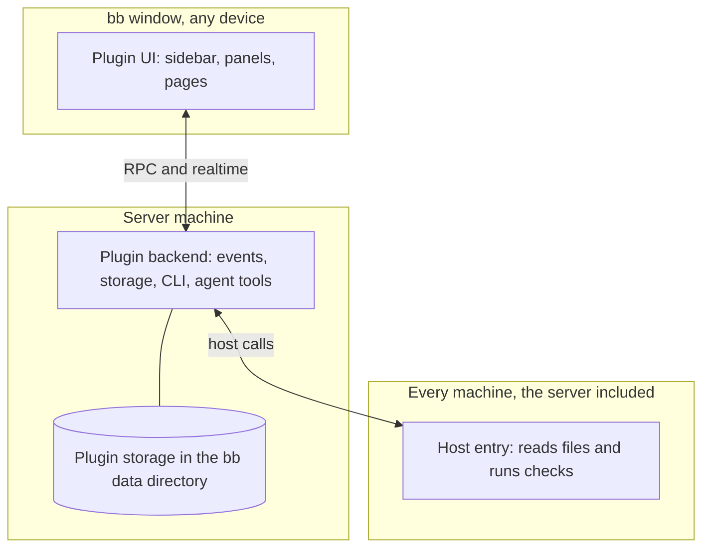

# How the plugins fit into bb

Each plugin is an ordinary bb plugin: a folder under `plugins/` with its own `package.json`, listed in [`.bb/plugins.json`](../../.bb/plugins.json) so `bb plugin install --plugin <name>` can pick it out of this repository. They share no code at run time and do not know about each other.

## Where each part runs

A bb plugin can have up to three parts, and the plugins use them differently.

```mermaid
flowchart TB
  subgraph server["Server machine"]
    backend["Plugin backend: events, storage, CLI, agent tools"]
    store[("Plugin storage in the bb data directory")]
    backend --- store
  end
  subgraph window["bb window, any device"]
    app["Plugin UI: sidebar, panels, pages"]
  end
  subgraph machine["Every machine, the server included"]
    host["Host entry: reads files and runs checks"]
  end
  app <-->|RPC and realtime| backend
  backend <-->|host calls| host
```

| Plugin | Backend | UI | Host entry |
|---|---|---|---|
| Thread Glance | Stamps thread start, finish and wait times; keeps a short note per thread; tracks scheduled sends; keeps preferences; serves `bb thread-glance` | The sidebar thread list | none |
| Thread Usage | Builds the ledger from bb's events, sweeps the gateway, prices turns; serves `bb thread-usage` and the `thread_usage` tool | Header chip, Usage tab, Thread usage page, settings section | Reads harness session logs on the machine that ran a thread |
| Team Onboarding | Reads the manifest, schedules checks, syncs skills, installs approved plugins and marketplaces, sets machine variables; serves `bb team-onboarding` | Onboarding page, sidebar badge, home **Setup** line, **Team manifest** tab, **Manifest file** settings section | Runs the checks and fixes on each machine |
| OpenAI-compatible inference | Registers an AI service per Endpoint, and reports whether each is ready; sends the Endpoints to the host entry | none | Sends bb's AI tasks to the Endpoints, from the primary machine |
| Pocket Navigation | none | The sidebar navigation | none |
| Cache Keeper | Watches Claude Code threads through bb's events, keeps each one's idle stretch, sends compactions, keep-warms and check-ins; serves `bb cache-keeper` and the `cache_keeper_compact_when_idle` tool | Composer chip and banner, sidebar glyph, Cache Keeper page, **Agent tools** settings section | Reads Claude Code transcripts and background output on the machine that runs a thread |
| UI Tweaks | Keeps the two choices and announces a change to every window | The two settings rows; a content script that restyles bb's thread view and New-thread screen | none |

The **server machine** is the machine that runs the bb server and holds its data directory (`bb status` prints it as `Data dir`, for example `/var/lib/bb/.bb` on a server where bb runs as a service user). Every machine, the server machine included, runs bb's daemon, and all are listed under Settings → Machines. A backend always runs on the server machine; a host entry runs in the daemon of whichever machine the backend calls.

All seven rely on plugin APIs that bb marks experimental, and are built against bb 0.43 and plugin SDK 0.5.9, except OpenAI-compatible inference, Pocket Navigation, Cache Keeper, UI Tweaks and Thread Usage, which need bb 0.44 and plugin SDK 0.5.29 (`engines` in each `package.json`). A bb upgrade that renames one of those APIs can stop a plugin loading until the plugin is updated; `bb status` warns when an enabled plugin is not running.

## Threads and trees

A **harness** is the coding agent a thread runs on, such as Claude Code, Codex, pi or Cursor; bb calls it the thread's provider.

A **child thread** is one another thread spawned: bb records the spawner as its **parent thread**. A thread with no parent is a **root**. A thread's **thread tree**, or **tree**, is the thread and every thread under it: its children, their children, and so on.

Thread Glance lists a root's tree together, so one busy parent thread does not push other work off the screen. Thread Usage adds up a tree's cost, so a parent thread's figure includes what its workers spent. A **fork** (a thread started from another thread's history, side chats included) is not a child and is not in the tree: bb records it as a copy, not as delegated work.

## What each plugin stores

| Plugin | Where | What |
|---|---|---|
| Thread Glance | The plugin's key-value store on the server for layout preferences, and its own `<data dir>/plugins/thread-glance/data.db` for the rest; the browser's `localStorage` for Density and Branch line, and whether the device has run the first-run import, kept per device | Layout preferences, per-thread time stamps, and a short note per thread: what it asks, what failed, or its last reply |
| Thread Usage | `<data dir>/plugins/thread-usage/data.db` (SQLite) | Turn records, gateway rows, harness-log entries, the thread tree |
| Team Onboarding | The plugin's storage on the server; `<data dir>/skills`; files on each machine it fixed | Results by category, approvals, which skill folders it installed |
| OpenAI-compatible inference | `<data dir>/plugins/openai-inference/host-data/`, readable only by bb's user | `learned-fields.json`, the request fields each Endpoint refused |
| Pocket Navigation | nothing of its own | It reads bb's own `sidebar.pluginPanelOrder` and `sidebar.visiblePluginPanels`, and writes neither |
| Cache Keeper | `<data dir>/plugins/cache-keeper/data.db` (SQLite) | Each thread's switches, setting and idle stretch, how far it has read each transcript, the background tasks it watches, 90 days of what it sent, the Agent tools rows, fetched price lists |
| UI Tweaks | The plugin's key-value store on the server | The text size and transcript width choices |

`bb plugin uninstall` deletes a plugin's settings, secrets and schedules. Thread Usage's `data.db` stays, and a reinstall reads it again; so does Thread Glance's, with its stamps and notes. Cache Keeper's `data.db` stays too, with every thread's switches; on its first load after a reinstall Cache Keeper switches off every thread's Compact when idle, every tree top's Keep warm while waiting, every Skip and the Agent tools, and puts its four settings back to their defaults, "Check on stalled tasks" off among them, so nothing is spent unasked, and the first line of `bb cache-keeper status` says so until [a switch, a Skip or a line is next changed](../reference/cache-keeper-settings.md#after-a-reinstall). To start from nothing, delete `data.db` while the plugin is uninstalled. What Team Onboarding wrote outside its own storage (team skills, SSH key and config, git config, machine variables) stays too, since it belongs to the machine, not the plugin. UI Tweaks' two choices stay in its key-value store until the next install clears them, so a reinstall starts at Medium. OpenAI-compatible inference's `learned-fields.json` stays as well; [what stays after uninstalling](../reference/openai-inference-settings.md#what-stays-after-uninstalling) says to delete them.

Team Onboarding's full list of files it writes is under [what it touches](team-onboarding-checks.md#what-it-touches).

None of the seven sends anything off the bb server except where you point it: Thread Usage and Cache Keeper fetch public price lists, and Thread Usage reads your gateway; Team Onboarding talks to GitHub and to the sources your manifest names; OpenAI-compatible inference sends bb's AI task prompts, which quote your thread prompts and diffs, to the Endpoints you select.
