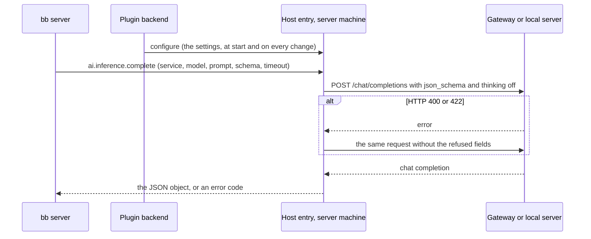

# How a helper completion is sent

bb titles every new thread, and writes commit messages, with a **helper completion**: one prompt and a JSON Schema in, one JSON object out. It sends each to the service that `BB_INFERENCE` names, and to `BB_INFERENCE_FALLBACK` after a timeout, a rate limit or an unavailable service. OpenAI-compatible inference adds the `gateway` and `local` services, which send the completion to any server that speaks OpenAI Chat Completions. The [reference](../reference/openai-inference-settings.md) lists the services, settings and error codes.

## Where the request is made

bb calls the plugin's host entry, which runs in bb's daemon on the server machine, not in the plugin's backend. The host entry cannot read the plugin's settings, so the backend sends them to it when the plugin starts and whenever a setting changes. The host entry keeps them in a file only bb's user can read, so a daemon worker that restarts still has them. The gateway's environment variables are read by the host entry itself, from the environment bb's daemon was started with.

## Structured output

The request asks for the answer three ways at once, because servers honour different ones:

1. `response_format: {type: "json_schema", json_schema: {name: "result", schema, strict}}`. OpenAI's models, LiteLLM, llama.cpp and LM Studio constrain the answer to the schema. `strict` is true only when the schema meets OpenAI's strict-mode rules (every property required, `additionalProperties: false`); bb's title schema does not, and OpenAI refuses strict mode for it with HTTP 400.
2. The prompt ends with an instruction to reply with only a JSON object matching the schema, and the schema itself. bb's prompt asks the model to call a `result` tool, which a Chat Completions request without tools does not have, so the instruction also says not to call any tool. A server that ignores `response_format`, such as mlx_lm.server, still gets a JSON answer this way.
3. The answer is read leniently. The host entry drops any reasoning before a `</think>`, takes the first JSON object in the text, code fence or prose around it included, and checks that the keys the schema requires are there. When `content` is empty it reads `reasoning_content` instead, where a server that splits out reasoning puts an answer the model never finished thinking about.

A server that refuses `response_format` or a thinking field answers HTTP 400, or 422 from servers built on FastAPI. The host entry then sends the request once more, within the same timeout. If the error names a thinking field, only the thinking fields are left out. Otherwise `response_format` and the thinking fields both are. When that second request succeeds, the host entry remembers it for that base URL and model until its worker restarts, so the next completion goes straight to the request that works. A second request that fails too is not remembered, because a 400 or 422 can also mean an unknown model or, from LiteLLM, a spent budget.

## Reasoning effort

bb asks for helper completions with no reasoning: they are short, and bb allows 5 seconds for a title. The two services ask for that differently.

**`gateway`** sends `reasoning_effort: "none"`. LiteLLM passes it on to OpenAI models from GPT-5 on (on Azure too) when its model list marks the model as accepting `"none"`. Otherwise LiteLLM refuses it with HTTP 400, unless the proxy sets `drop_params: true`, and the host entry then leaves it out. For Gemini, LiteLLM turns `"none"` into a thinking budget of 0 on Gemini 2.5, and into the lowest thinking level on Gemini 3, which lowers thinking but does not turn it off.

**`local`** sends `chat_template_kwargs: {enable_thinking: false}`, which mlx_lm.server, vLLM and llama.cpp pass to the model's chat template, and a top-level `enable_thinking: false`, which mlx-vlm reads. A template without that switch ignores it, and the model then thinks as it always does. Both services also send `max_tokens: 256`, enough for a title or a commit message. Without it a local server uses its own default, 512 tokens on mlx_lm.server, and a model that thinks anyway spends bb's few seconds thinking.
