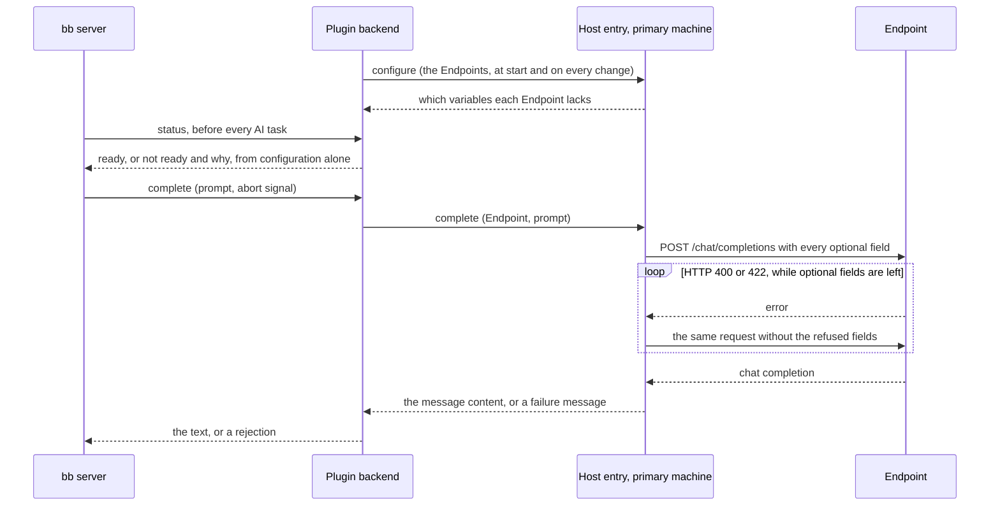

# How an AI task is sent

bb titles every new thread, and writes commit messages, with an AI task: one prompt in, one piece of text out. bb writes the prompt, sends it to the service selected for that task, and cleans the reply itself: think blocks, quotes, labels and extra lines. OpenAI-compatible inference makes each [Endpoint](../reference/openai-inference-settings.md#endpoints) you list a service, which sends the prompt to a server that speaks OpenAI Chat Completions. A LiteLLM gateway and a local server get the same request: every field that asks for no reasoning is sent to both, and a field a server refuses is left out.

You choose the service for each AI task, since Automatic never picks an Endpoint, and bb has no fallback from one selected service to another; [selecting an Endpoint](../reference/openai-inference-settings.md#selecting-an-endpoint) says how.

## Where the request is made

The request is made by the plugin's host entry, which runs in bb's daemon on the primary machine, not in the plugin's backend. There `${NAME}` expands from bb's environment and `localhost` is the machine the local server runs on. The host entry cannot read the plugin's settings, so the backend sends it the Endpoints when the plugin starts and whenever a setting changes, and the host entry answers which variables each Endpoint lacks. The backend keeps that answer to report an Endpoint's status without calling the host entry or the server.

An Endpoint's `${NAME}` references are expanded for each request and the expanded URL and key stay inside it: the plugin's file, bb's list of services and the failure messages keep the reference.

## What the request asks for

The request is one `POST <url>/chat/completions`, with `Authorization: Bearer <key>` only when the Endpoint has a key. Its `model` is the Endpoint's `model`, `stream` is false, and `messages` holds one user message: bb's prompt, unchanged. Nothing in it asks for JSON, since bb asks for plain text.

The request asks for no reasoning, since a title is short and bb allows 5 seconds for one. Servers read that from different fields, so the request sends all of them:

| Field | Read by |
|---|---|
| `reasoning_effort: "none"` | OpenAI models, and LiteLLM, which passes it on or translates it |
| `chat_template_kwargs: {enable_thinking: false}` | mlx_lm.server, vLLM and llama.cpp, which pass it to the model's chat template |
| `enable_thinking: false` | mlx-vlm |
| `max_tokens: 256` | Every server: enough for a title or a commit message. Without it a local server uses its own default, 512 tokens on mlx_lm.server, and a model that thinks anyway spends bb's few seconds thinking |

A chat template without an `enable_thinking` switch ignores it, and the model then thinks as it always does. Through LiteLLM, `reasoning_effort: "none"` reaches OpenAI models from GPT-5 on (on Azure too) only when LiteLLM's model list marks the model as accepting it; otherwise LiteLLM refuses it, below. For Gemini, LiteLLM turns it into a thinking budget of 0 on Gemini 2.5, and into the lowest thinking level on Gemini 3, which lowers thinking but does not turn it off.

The answer handed back to bb is the message content as the server wrote it. A completion whose content is empty is a failure, even when the server put text in a separate reasoning field.

## Fields a server refuses

A server that refuses a field answers HTTP 400, or 422 from servers built on FastAPI. LiteLLM refuses `reasoning_effort` for a model its list does not mark, unless the proxy sets `drop_params: true`; a server that validates its input strictly refuses fields it does not know.

The host entry then sends the request again, within the same time limit, without the fields the error names: `reasoning_effort`, `chat_template_kwargs`, `enable_thinking` or `max_tokens`. An error that names none of them gets a request without all four. When a request then succeeds, the host entry remembers what it dropped for that URL and model, so the next request goes straight to the one that works. A request that fails after every drop is not remembered, because a 400 or 422 can also mean an unknown model or, from LiteLLM, a spent budget.

### Why what was dropped is kept in a file

bb starts the host entry's worker when a request needs it and stops it after a few idle minutes. Remembered only in the worker's memory, the dropped fields would be lost between most titles, and each title would pay again for every refusal: two extra requests to a server that refuses `chat_template_kwargs` and then `enable_thinking`, inside bb's 5 seconds. So the host entry keeps them in `learned-fields.json`, readable only by bb's user, in the plugin's data directory on the primary machine. It reads the file on its first call and writes it only when it learns something new. A file it cannot read or parse counts as empty, so a request never fails because of it.

An entry is keyed by the Endpoint's URL as the settings write it, `${NAME}` references included, and by the model. It is forgotten in two cases:

- **The Endpoint's URL changes in the settings**, or the Endpoint is removed. What one URL refused says nothing about another.
- **The server names a field it was not sent.** When the first request leaves out remembered fields and its 400 or 422 names one of them, the server has changed, for example to one that now needs `max_tokens`. The host entry forgets the entry and sends the request again with every field, then drops fields as above.

A URL that stays the same while `${NAME}` points somewhere else keeps its entry until the second case applies.
