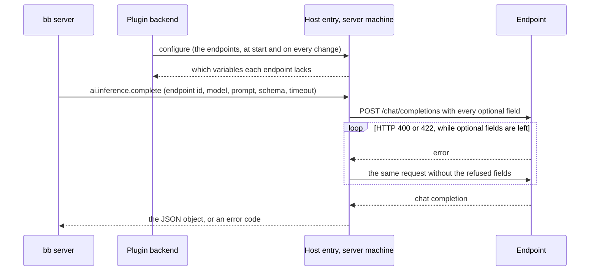

# How a helper completion is sent

bb titles every new thread, and writes commit messages, with a **helper completion**: one prompt and a JSON Schema in, one JSON object out. It sends each to the service that `BB_INFERENCE` names, and to `BB_INFERENCE_FALLBACK` after a timeout, a rate limit or an unavailable service. OpenAI-compatible inference makes each [endpoint](../reference/openai-inference-settings.md#endpoints) you list a service, which sends the completion to a server that speaks OpenAI Chat Completions. A LiteLLM gateway and a local server get the same request: every field that asks for JSON or for no reasoning is sent to both, and a field a server refuses is left out.

## Where the request is made

bb calls the plugin's host entry, which runs in bb's daemon on the server machine, not in the plugin's backend. The host entry cannot read the plugin's settings, so the backend sends it the endpoints when the plugin starts and whenever a setting changes. The host entry keeps them in a file only bb's user can read, so a daemon worker that restarts still has them.

An endpoint's `${NAME}` references are expanded there too, from the daemon's environment, for each request. bb's machine variables reach that environment and not the server's, and the expanded URL and key stay inside the request: the file, bb's list of services and the error messages keep the reference or the endpoint's id. The host entry also answers which variables each endpoint lacks, and the backend registers only the endpoints that lack none.

## What the request asks for

The request asks for JSON three ways at once, because servers honour different ones:

1. `response_format: {type: "json_schema", json_schema: {name: "result", schema, strict}}`. OpenAI's models, LiteLLM, llama.cpp and LM Studio constrain the answer to the schema. `strict` is true only when the schema meets OpenAI's strict-mode rules (every property required, `additionalProperties: false`); bb's title schema does not, and OpenAI refuses strict mode for it with HTTP 400.
2. The prompt ends with an instruction to reply with only a JSON object matching the schema, and the schema itself. bb's prompt asks the model to call a `result` tool, which a Chat Completions request without tools does not have, so the instruction also says not to call any tool. A server that ignores `response_format`, such as mlx_lm.server, still gets a JSON answer this way.
3. The answer is read leniently. The host entry drops any reasoning before a `</think>`, takes the first JSON object in the text, code fence or prose around it included, and checks that the keys the schema requires are there. When `content` is empty it reads `reasoning_content` instead, where a server that splits out reasoning puts an answer the model never finished thinking about.

bb asks for no reasoning, since a title is short and bb allows 5 seconds for one. Servers read that from different fields, so the request sends all of them:

| Field | Read by |
|---|---|
| `reasoning_effort: "none"` | OpenAI models, and LiteLLM, which passes it on or translates it |
| `chat_template_kwargs: {enable_thinking: false}` | mlx_lm.server, vLLM and llama.cpp, which pass it to the model's chat template |
| `enable_thinking: false` | mlx-vlm |
| `max_tokens: 256` | Every server: enough for a title or a commit message. Without it a local server uses its own default, 512 tokens on mlx_lm.server, and a model that thinks anyway spends bb's few seconds thinking |

A chat template without an `enable_thinking` switch ignores it, and the model then thinks as it always does. Through LiteLLM, `reasoning_effort: "none"` reaches OpenAI models from GPT-5 on (on Azure too) only when LiteLLM's model list marks the model as accepting it; otherwise LiteLLM refuses it, below. For Gemini, LiteLLM turns it into a thinking budget of 0 on Gemini 2.5, and into the lowest thinking level on Gemini 3, which lowers thinking but does not turn it off.

## Fields a server refuses

A server that refuses a field answers HTTP 400, or 422 from servers built on FastAPI. LiteLLM refuses `reasoning_effort` for a model its list does not mark, unless the proxy sets `drop_params: true`; a server that validates its input strictly refuses fields it does not know.

The host entry then sends the request again, within the same timeout, without the fields the error names: `response_format` (or `json_schema`), `reasoning_effort`, `chat_template_kwargs`, `enable_thinking` or `max_tokens`. An error that names none of them gets a request without all five, which relies on the prompt alone. When a request then succeeds, the host entry remembers what it dropped for that URL and model until its worker restarts, so the next completion goes straight to the request that works. A request that fails after every drop is not remembered, because a 400 or 422 can also mean an unknown model or, from LiteLLM, a spent budget.
