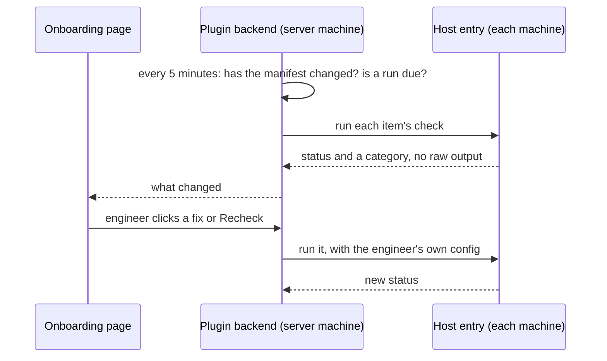

# How Team Onboarding checks machines

Team Onboarding keeps checking every machine against the team's setup, in the background, for as long as it is installed. Two rules shape how: background work must never stop an engineer with a prompt, and nothing the team's manifest names runs until an engineer has seen it and said yes.

## Where the work happens

The backend on the [server machine](how-the-plugins-fit-bb.md#where-each-part-runs) reads the manifest, decides what is due, and keeps the results. The checks themselves run in the plugin's host entry on each machine, the server included, as the user bb's daemon runs as. The host entry offers a fixed list of operations (make an SSH key, ask gh who is logged in, run `git ls-remote`, read a tool's version); the only free-form command it runs is a team command the engineer approved.

A fix that needs a person (a login, `sudo`, a tool install) opens a terminal on that machine, under the item that asked for it. When the terminal exits, the item is checked again.

## The schedule

Every 5 minutes the backend reads the manifest file's sha256 and nothing else, unless a run is due. A run is due once per **Check every** interval, 30 minutes by default; only then does anything touch the network. Checks also run at once when the manifest file changes, when a machine reconnects, and when an engineer presses **Recheck**, **Recheck all** or runs `bb team-onboarding check`.

## Two questions about GitHub

On a machine other than the server, bb gives agents the server's GitHub login: its token, git's credential setup, and a rewrite of `git@github.com:` URLs to HTTPS. This is bb's **built-in git**. So "can this machine reach GitHub?" has two answers, and each check asks the one it needs:

- **As agents see it**, with bb's token and rewrite in place: can agents here clone the team's repositories? Repository access is checked this way.
- **As the machine is on its own**, with bb's additions removed: does this machine have its own gh login and SSH key? The SSH items and the gh login are checked this way.

The manifest's `github.mode` picks between the two setups. In `builtin` mode, the default, the server logs in once and bb shares that login; SSH items then apply to the server only. In `per-machine` mode every machine gets its own gh login and SSH key; switching to it turns bb's built-in git off for the whole server, after a confirmation.

## Checking without prompting

A check that runs every 30 minutes must not open a keychain dialog, ask for a passphrase, or pop up a password manager. So background checks run with none of the machine's own prompting machinery:

- git asks no credential helper and no askpass program, and reads none of the user's git config;
- ssh reads no `~/.ssh/config` and asks no SSH agent, only the key file the plugin manages;
- gh runs with its prompts disabled;
- git runs from an empty folder the plugin owns, so no repository's config in the home directory applies.

The price is that a working setup can look unknown from the background: an SSH key held only in an agent, or a host alias defined only in `~/.ssh/config`, is invisible there. Such an item reads **Checked without your ssh config; Recheck to use it**, and no safe fix touches it. A **Recheck** on the row, or a fix started from the page, runs with the engineer's full git and SSH config, because the engineer is there to answer a prompt. Commands the CLI, schedule or agents start never count as the engineer being there.

## Why the manifest is a file

The plugin reads the manifest from a file on the server and never fetches it. A URL to a private repository needs credentials, and a background fetch that needs credentials either prompts, which the plugin must not do, or fails. A file put in place by an administrator or a bootstrap script needs none, and its sha256 tells the plugin when it changed.

## Why approvals happen only in the page

The manifest comes from a team repository, and a team command runs on engineers' machines with their access. Anyone who can change that repository could otherwise run code on every machine. So each team command, plugin source and marketplace is shown exactly as written and runs only after an engineer [approves](../reference/team-onboarding-items.md#approvals) it.

An agent in any thread can call every one of a plugin's RPC methods through `bb plugin rpc call`, and can run `bb team-onboarding`. So neither can approve anything, and neither runs any fix outside the [safe list](../reference/team-onboarding-items.md#safe-fixes). Approvals, logins, machine variables and terminals go through one route that checks for headers only a browser sets on its own page's requests, and the page refuses them when the browser reports that automation drives it.

This keeps agents out, not a determined local process: a program running as the same user can still forge those headers. bb offers no way for a plugin to know that a person is at the other end.

## What it records

Results store a category (`no-access`, `sso-required`, `read-only`), never raw output, because git, gh and ssh print repository URLs and organisation names. Ids from the manifest are what the plugin stores and logs. The last run's raw output is kept in server memory only, shown under **Show details** with secrets masked.

## What it touches

- On the server machine: team skills it installed in `<data dir>/skills` (never a folder it did not install), gh's login and `gh auth setup-git` when the engineer logs in, and the plugins the engineer approved.
- On each machine where SSH applies: `~/.ssh/bb_ed25519`, `~/.ssh/bb_known_hosts`, `~/.ssh/bb_config`, and git's global `core.sshCommand`. The user's own `~/.ssh/config` is never edited; the plugin's config includes it.
- Machine variables the engineer typed into an `env` item's form. Every agent on every machine can read them.
