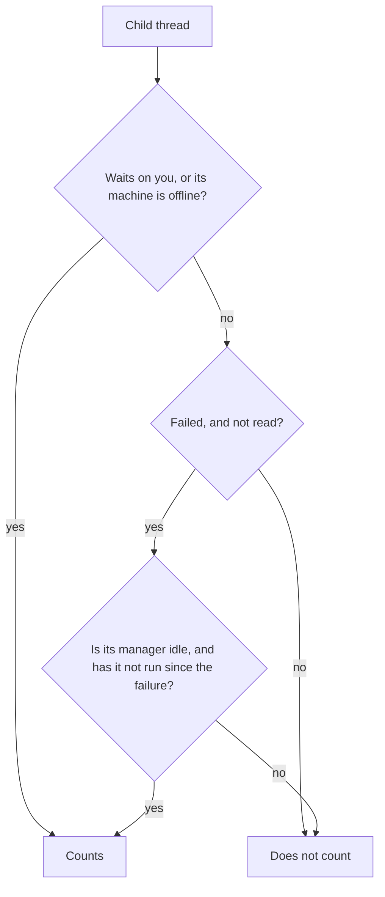

# What "needs attention" means

Thread Glance is built around one question: which threads can only you move forward? A thread working on its own does not need you. A thread asking a question does. Everything the list does beyond drawing rows (the **Needs attention** filter, the header counters, the colour of a children chip, which folded threads open by themselves) answers that one question the same way.

## What a thread needs you for

A thread **needs attention** when it:

- waits on you: a question, an approval or a plan to review;
- failed, and you have not opened it since;
- has a queued message that failed to send;
- waits for a machine that is offline, since only you can bring it back;
- finished, and you have not read it since.

A thread that is working does not need attention, and nor does one you have read, even if it failed. Its row keeps the red glyph so you can still see the failure, but it no longer counts. [States and glyphs](../reference/thread-glance-states.md) lists every state a row can show.

## What a child thread adds

A manager that spawns ten workers should not raise ten flags. Its workers finish, fail and retry as part of the manager's job, and the manager hears about each one. So by default a child counts toward attention only when the manager cannot deal with it:

Here a child's [manager](how-the-plugins-fit-bb.md#threads-and-families) is taken to be the nearest ancestor that has a row, since a hidden thread cannot be acted on. It is idle when it is not working, setting up, running background work, or holding a queued or scheduled message. A failure under an idle manager that has not run since is an **orphaned failure**: nobody is going to pick it up.

A child that only finished unread never counts. It keeps its own unread dot and bold title, and you see it when you open the [family](how-the-plugins-fit-bb.md#threads-and-families).

Filter settings → **Child threads in Needs attention** → **Everything** makes a child count exactly as a root does.

## Families and folding

A thread's family is listed as one unit: only the root gets a row in its group, and its children sit behind a chip on that row. The chip shows the number of children and the most urgent thing among them, so a collapsed family still says whether it needs you.

Opening a chip shows one level: the root's direct children. A child with children of its own has its own chip. So a grandchild never shows without the parent that explains it.

Two folds keep quiet threads out of the way. A thread is **quiet** when it is idle, a draft or a read failure, is read, is not open, and has nothing under it that is not quiet.

- In each group, all roots that are not quiet show, then the 5 most recent quiet ones, then an `N older` row for the rest.
- Inside an open family, all children that are not quiet show, then the 3 most recent quiet ones, then an `N more child threads` row.

The children shown stay the same while you move between them. Opening a child that sits behind the fold adds that one row, and nothing else moves out to make room.

## What opens by itself

When a thread inside a collapsed family starts to need attention, as defined above, Thread Glance opens the path to it: the group, the `N older` fold, and each chip down to the thread. It reveals only that thread and the threads above it, not the whole family. The same happens for the thread you open.

This happens on a change, not on every render: when a thread starts to need attention, or when you open another thread. If you collapse it again, it stays collapsed until the next change. A child that merely finished does not open anything, because a manager with many workers would otherwise keep reopening.

## Why rows do not jump around

Under **Updated** sort, a family's place comes from the most recent attention time of any thread in it. bb moves that time only when a root finishes its turn, or when any thread fails. Questions, approvals and a child finishing do not move rows; the counters and the filter carry them instead. So the list stays still while threads work, and a family rises when its manager finishes or something in it breaks.

**Working first** puts running threads on top, as bb's own list does. It is off by default because every start and stop then reorders the list.

## Children bb never marks unread

bb marks a thread unread when it finishes, but for a child only when it fails. Thread Glance also marks a child unread when it finishes after you last looked at it. To know when that was, Thread Glance's backend records when each thread starts, finishes and begins waiting on you, and when you last opened each child. These **stamps** live on the bb server, so every window agrees and a reload keeps them. They also give the working timer and how long a thread has waited on you.

**Mark unread** on a child clears the record that you looked at it, so it shows as finished and unread again.
