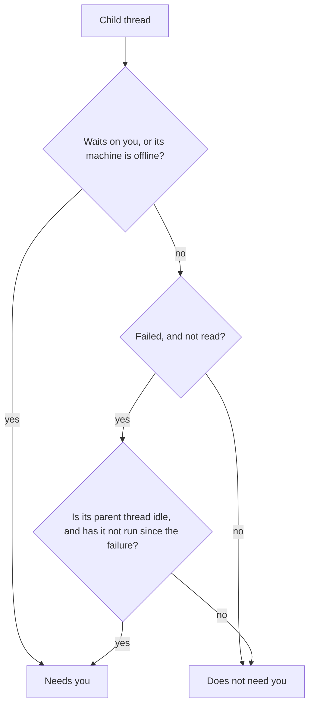

# What "Needs you" means

Thread Glance is built around one question: which threads can only you move forward? A thread working on its own does not need you. A thread asking a question does. Everything the list does beyond drawing rows (the **Needs you** section, the header counters, the colour of a chip, which folded threads open by themselves) answers that one question the same way.

## What a thread needs you for

A root thread **needs you** when it:

- waits on you: a question, an approval or a plan to review;
- failed, and you have not opened it since;
- has a queued message that failed to send;
- waits for a machine that is offline, since only you can bring it back;
- finished, and you have not read it since.

A thread that is working does not need you, and nor does one you have read, even if it failed. Its row keeps the red glyph so you can still see the failure, but it no longer counts. [States and glyphs](../reference/thread-glance-states.md) lists every state a row can show.

## What a child thread adds

A parent thread that spawns ten workers should not raise ten flags. Its workers finish, fail and retry as part of the parent thread's job, and the parent thread hears about each one. So by default a child needs you only when its parent thread cannot deal with it:

Here a child's [parent thread](how-the-plugins-fit-bb.md#threads-and-families) is taken to be the nearest ancestor that has a row, since a hidden thread cannot be acted on. It is idle when it is not working, setting up, running background work, or holding a queued or scheduled message. A failure under an idle parent thread that has not run since is an **orphaned failure**: nobody is going to pick it up. A parent thread that is running is usually already handling the failure, so showing it would move busy families in and out of the section.

A child that only finished unread does not need you. It keeps its own unread dot and bold title, and you see it when you open the [family](how-the-plugins-fit-bb.md#threads-and-families) and its fold.

The setting **Needs you counts every child** makes a child count exactly as a root does: every failed or finished-unread child needs you too. The same setting decides which children a family's fold keeps out, below.

## The Needs you section

A family with a thread that needs you leaves its group (project, custom section, machine or Pinned, hidden groups included) and is drawn in **Needs you**, above every group. One place per thread: the family is not listed twice.

In the section, a family shows the path from its root down to each thread that needs you, and to the open thread. The root shows the name of its home group where the age normally is. Its other child threads are not drawn: one `+N more` line under the family counts them. Rows in the section carry no chip, since the section never opens one.

A family stays in the section while you have one of its threads open, even after nothing in it needs you any more, so opening an unread thread does not move it out from under the pointer. It goes back to its group once you open a thread outside it. Opening a family that never needed you does not bring it into the section.

The section lists the families most urgent first: waiting on you, then failed, then offline, then unread. Within each, it follows **Sort by** in the field's own direction; the ↓/↑ button reverses the groups only. The header shows how many families the section holds. It cannot be collapsed or hidden, and it is absent when no family is in it.

## Families and folding

A thread's family is listed as one unit: only the root gets a row in its group, and its children sit behind a chip on that row. The chip shows the number of children and the most urgent thing among them, so a collapsed family still says what it holds.

Opening a chip shows one level: the root's direct children. A child with children of its own has its own chip. So a grandchild never shows without the parent that explains it.

Two older folds keep threads with nothing to show out of the way, one for roots and one for children, and each has its own test. Both read the **quiet thread** test: a thread is quiet when it is not running, does not need you and is not the one open.

With **Collapse older threads** on, each group shows every root that is not quiet, then its 5 newest quiet roots, then an `N older` row for the rest. The newest are by creation under **Created**, and by latest activity otherwise, whatever the direction. With it off, every root shows and no `N older` row appears.

Inside an open family, all children that are not quiet show, then the 3 most recent quiet ones, then an `N more child threads` row, whatever **Collapse older threads** says. A child is quiet unless it or anything under it:

- works, sets up or runs background work;
- needs you, [as above](#what-a-child-thread-adds): waits on you, lost its machine, or has an orphaned failure.

A hidden thread under it counts only for the second, and an archived child is always quiet.

So a parent thread whose twelve workers all finished shows the 3 most recent and folds the other 9; each keeps its unread dot when you open the fold. With **Needs you counts every child** on, a finished, unread child needs you, so its family is in Needs you instead.

Both folds are worked out as if no thread were open, so the roots and children shown stay the same while you move between them. Opening a thread that sits behind a fold, or one of its descendants, adds that one row, and nothing else moves out to make room.

## What opens by itself

When you open a thread inside a collapsed family, Thread Glance opens the path to it: the group, the `N older` fold, and each chip down to the thread. It reveals only that thread and the threads above it, not the whole family. The same happens for a thread that starts to need you, so its family's chips stay open on the way to it once the family goes back to its group.

This happens on a change, not on every render: when a thread starts to need you, or when you open another thread. If you collapse it again, it stays collapsed until the next change. A child that merely finished does not open anything, because a parent thread with many workers would otherwise keep reopening.

## Why rows do not jump around

Under **Updated** sort, a family's place in its group comes from the most recent attention time of any thread in it. bb moves that time only when a root finishes its turn, or when any thread fails. A child finishing does not move rows. So groups stay still while threads work, and what needs you moves into the section rather than to the top of its group.

**Working threads first** puts running threads on top, as bb's own list does. It is off by default because every start and stop then reorders the list.

## Children bb never marks unread

bb marks a thread unread when it finishes, but for a child only when it fails. Thread Glance also marks a child unread when it finishes after you last looked at it. To know when that was, Thread Glance's backend records when each thread starts, finishes and begins waiting on you, and when you last opened each child. These **stamps** live on the bb server, so every window agrees and a reload keeps them. They also give the working timer and how long a thread has waited on you.

**Mark unread** on a child clears the record that you looked at it, so it shows as finished and unread again.
