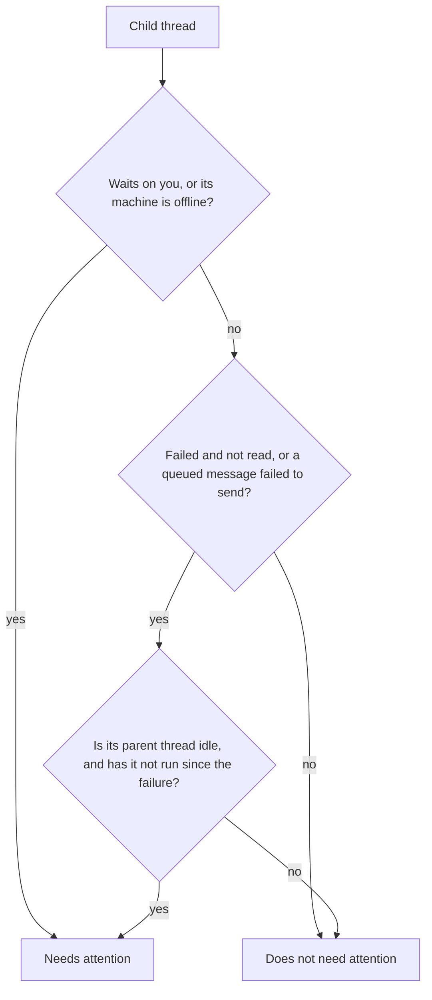
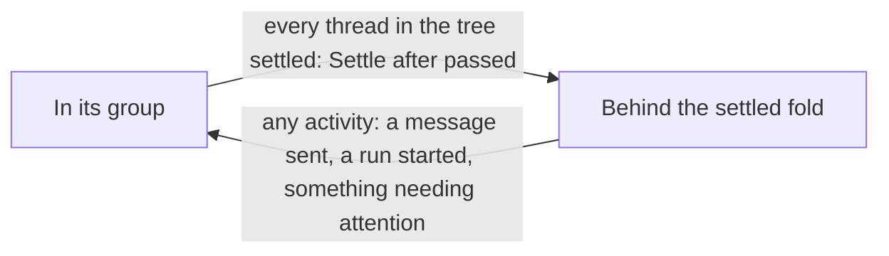

# What "Needs attention" means

Thread Glance is built around one question: which threads can only you move forward? A thread working on its own does not need attention. A thread asking a question does. Everything the list does beyond drawing rows (what a collapsed group still shows, the need-you filter, the header counters, which threads stay out of the settled fold, which folded threads open by themselves) answers that one question the same way.

## What a thread needs attention for

A root thread **needs attention** when it:

- waits on you: a question, an approval or a plan to review;
- failed, and you have not opened it since;
- has a queued message that failed to send;
- waits for a machine that is offline, since only you can bring it back;
- finished, and you have not read it since.

A thread that is working does not need attention, and nor does one you have read, even if it failed. Its row keeps the red glyph so you can still see the failure, but it no longer counts. [States and glyphs](../reference/thread-glance-states.md) lists every state a row can show.

## What a child thread adds

A parent thread that spawns ten workers should not raise ten flags. Its workers finish, fail and retry as part of the parent thread's job, and the parent thread hears about each one. So by default a child needs attention only when its parent thread cannot deal with it:

```mermaid
flowchart TD
  child["Child thread"] --> asks{"Waits on you, or its machine is offline?"}
  asks -->|yes| counts["Needs attention"]
  asks -->|no| failed{"Failed and not read, or a queued message failed to send?"}
  failed -->|no| not["Does not need attention"]
  failed -->|yes| idle{"Is its parent thread idle, and has it not run since the failure?"}
  idle -->|yes| counts
  idle -->|no| not
```

Here a child's [parent thread](how-the-plugins-fit-bb.md#threads-and-trees) is taken to be the nearest ancestor that has a row, since a hidden thread cannot be acted on. It is idle when it is not working, setting up, running background work, or holding a queued or scheduled message. A failure under an idle parent thread that has not run since is an **orphaned failure**: nobody is going to pick it up. A parent thread that is running is usually already handling the failure, so counting it would raise a flag for work already in hand.

A child that only finished unread does not need attention. It keeps its own unread dot and bold title, its parent's [children chip](../reference/thread-glance-states.md#the-children-chip) shows it, and you see it when you open the [tree](how-the-plugins-fit-bb.md#threads-and-trees).

The setting **Needs attention counts every child** makes a child count exactly as a root does: every failed or finished-unread child needs attention too. The same setting decides which children a tree's fold keeps out, below.

## Needs attention is a state, not a place

A tree that needs attention stays in its own group (project, custom section, machine, Pinned or Threads), in the place its sort gives it. Rows never move between places because something changed state: what needs attention is told by the row's glyph, its line, the parent's children chip and the group's counters.

A collapsed group still draws, under its header, every tree in it that needs attention, and nothing else. Collapsing a group hides what you have dealt with, never what waits on you.

## The need-you filter

The list header's `N need you` counts the trees that need attention across the whole list, hidden groups included, and is absent when none does. Turning it on leaves only those trees, each under its own group's header, a hidden group's included, so the whole list's worth of what needs you fits on one screen. Turning it off brings the full list back, and so does N reaching 0. The filter belongs to the window: it starts off on every load.

## Trees and folding

A thread's tree is listed as one unit: only the root gets a row in its group, and its children sit behind a [children chip](../reference/thread-glance-states.md#the-children-chip) on that row. The chip counts the root's direct children and leads with the glyph of the most urgent state anywhere below it, so a closed tree still says what it holds.

Opening a children chip shows one level: the root's direct children. A child with children of its own has its own chip. So a grandchild never shows without the parent that explains it.

Two folds keep threads with nothing to show out of the way: the settled fold for trees, and the `N more child threads` fold for children. Both start from the **quiet thread** test: a thread is quiet when it is read, not the one open, and idle, only a draft, or failed: not running, holding no queued or scheduled message, and not on an offline machine.

Inside an open tree, all children that are not quiet show, then the 3 most recent quiet ones, then an `N more child threads` row. A child is quiet unless it or anything under it:

- works, sets up or runs background work;
- needs attention, [as above](#what-a-child-thread-adds): waits on you, lost its machine, or has an orphaned failure.

A hidden thread under it counts only for the second, and an archived child is always quiet.

So a parent thread whose twelve workers all finished shows the 3 most recent and folds the other 9; each keeps its unread dot when you open the fold. With **Needs attention counts every child** on, a finished, unread child needs attention, so it stays out of the fold.

The fold is worked out as if no thread were open, so the children shown stay the same while you move between them. Opening a child that sits behind the fold, or one of its descendants, adds that one row, and nothing else moves out to make room.

## Settled threads

A **settled thread** is a quiet thread that does not need attention, is not pinned, and has had no activity of its own for the **Settle after** period: 12 hours, 1 day (the default), 3 days, 1 week, or Never, when nothing settles. Its activity is when it was created, last started, and last finished or failed; opening or renaming it is not activity.

A tree settles as one unit: it goes behind its group's settled fold only when every thread in it is settled, and a child never leaves its tree for the fold. Archived threads, shown with **Show archived threads**, take the same test. Pinned threads never settle, so Pinned has no fold.

```mermaid
flowchart LR
  live["In its group"] -->|"every thread in the tree settled: Settle after passed"| fold["Behind the settled fold"]
  fold -->|"any activity: a message sent, a run started, something needing attention"| live
```

Settling is worked out afresh every time the list is drawn, never stored, so a tree enters the fold as the period passes or you change Settle after, and leaves it as soon as anything in it moves, all without a reload. A thread's pull request plays no part: a merged one does not settle it sooner, and an open one does not keep it out. So a thread is in or out of the fold from the first paint, and the pull request badges and branch lines filling in never move it. bb's thread list carries each thread's last finish, so the plugin's own record of when threads last started and finished, which arrives a moment later, rarely moves one either; a turn you stopped may be the exception. There is no manual settle: bb's archive already takes a thread out of the list.

When the thread you have open is in a settled tree, that tree is drawn just above the fold, which stays open or closed as you left it, so opening it moves no other row. Whether a group's fold is open is saved on the server, so it survives a reload and follows you to every window.

## What opens by itself

When you open a thread inside a closed tree, Thread Glance opens the path to it: each chip down to the thread, and its group if the group is collapsed. It reveals only that thread and the threads above it, not the whole tree. The same happens for a thread that starts to wait on you or fails, so its tree's chips stay open on the way to it; its group stays collapsed, since a collapsed group draws that tree anyway. A thread that finished unread opens no chip, and nothing opens the settled fold.

This happens on a change, not on every render: when a thread starts to need attention, or when you open another thread. If you collapse it again, it stays collapsed until the next change. A child that merely finished opens no chip, because a parent thread with many workers would otherwise keep reopening.

## Why rows do not jump around

Under **Updated** sort, a tree's place in its group comes from the most recent attention time of any thread in it. bb moves that time only when a root finishes its turn, or when any thread fails. A child finishing does not move rows, and neither does a thread starting or stopping. So groups stay still while threads work, and what needs attention stays where it is.

## Children bb never marks unread

bb marks a thread unread when it finishes, but for a child only when it fails. Thread Glance also marks a child unread when it finishes after you last looked at it. To know when that was, Thread Glance's backend records when each thread starts, finishes and begins waiting on you, and when you last opened each child. These **stamps** live on the bb server, so every window agrees and a reload keeps them. They also give the working timer and how long a thread has waited on you.

**Mark unread** on a child clears the record that you looked at it, so it shows as finished and unread again.
