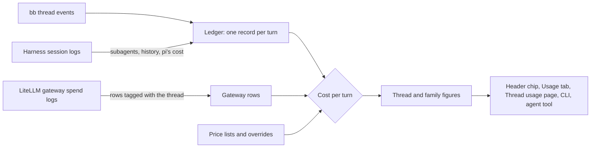

# How Thread Usage counts tokens and cost

bb reports how many tokens a thread used, but not what they cost, and not what the threads it spawned used. Thread Usage keeps its own record of every turn, prices it from the best source it has, and adds up [families](how-the-plugins-fit-bb.md#threads-and-families) when you ask.

## The ledger

The **ledger** is the plugin's own record of each turn: its model, tokens by kind (input, output, cache read, cache write, 1-hour cache write, reasoning), start and end, lines added and removed, and cost. It is built from bb's thread events as they arrive, and stored in the plugin's SQLite database.

It takes each turn's tokens from the per-request usage bb reports and adds them up itself. bb's own running total starts again from zero when the harness process restarts, so a sum of per-request figures is the one that stays right across restarts.

bb keeps those per-request events only for a short while once newer ones arrive. A plugin that was stopped, or installed after a thread began, can find some already gone. The plugin notices the gap and fills it from bb's running total when the harness did not restart in between; otherwise it marks the thread's history as partial and reads the harness's own logs to fill it. The moment the plugin first read a thread is its **first seen** time; before it, usage comes from logs.

## Harness logs

Some usage never reaches bb's events. The plugin's host entry reads each harness's session logs on the machine that ran the thread, for three things:

- **Claude Code subagents.** Their requests run inside the same session but bb never counts them. They are stored under the turn whose time they fall in.
- **History** from before the plugin was installed, or from a gap.
- **pi's own cost**, which pi writes per message.

Codex logs are read for history only. Cursor, run through ACP, reports no tokens to bb and keeps no log the plugin reads, so its threads show no usage.

Reads are incremental: the host entry remembers how far it read each file and parses only what was appended. When a machine is offline, the thread is marked with the machine's name and the time, and read again when the Usage tab opens and every 15 minutes, so a missing log shows as missing, never as zero.

The **Read harness logs** setting turns this off. Subagent tokens then show only as a gateway remainder, if a gateway is connected.

## Prices

A turn's cost comes from the first [cost source](../reference/thread-usage-cost-sources.md#cost-sources) that has it: the gateway, then the harness, then an estimate of tokens times a price. Estimates use public price lists that the plugin fetches daily, so they stay current rather than drifting from a copy bundled at build time. Costs are worked out when read, not stored, so a price change moves the estimate of every past turn with it. A gateway or harness cost is what was actually billed and never moves.

A model with no price anywhere is **unpriced**. Its tokens still show, labelled as such, because showing `$0.00` would read as free.

## Gateways

When a LiteLLM gateway sits between the harnesses and the model providers, it knows exactly what each request cost under your own prices and aliases. To find a thread's requests there, each request has to carry the thread's id. For Claude Code, the plugin adds a header to every command bb runs; Codex and pi need one line in their own config, since their gateway settings live there. The gateway logs the header as a session id, and the plugin sweeps the gateway's spend log for rows whose session id names a thread it knows, about once a minute while threads run.

A gateway row belongs to the turn it started in, up to 30 seconds after the turn ended. Rows outside every turn (a title, a compaction, a subagent that outlived its turn) are shown as **Outside turns**.

Gateway rows are kept in the plugin's database. A gateway may keep its spend logs for less time than the plugin keeps its records, so a sweep only adds or updates rows and never lowers a total.

[Connect a LiteLLM gateway](../how-to/thread-usage-connect-litellm.md) has the steps.

## Billed and subscription use

A thread's **billing mode** says how its tokens are paid for: through the gateway, with an API key, or on a subscription plan. On a subscription, tokens are not billed one by one, so a dollar figure would be misleading as a bill. The **headline** is the large figure at the top of the Usage tab and in the header chip's card, with its cost source and billing mode beside it. On a subscription, tokens lead the headline, and dollars are shown smaller as a **list-price equivalent**: what the same tokens would cost at public list prices. A family that mixes both shows the billed dollars as its headline and the subscription tokens on a second line; the two sums are never added into one billed figure.

The plugin reads the billing mode from what the harness reports about its rate limits, and from how requests were routed. [Attribution and billing](../reference/thread-usage-cost-sources.md#billing-modes) lists the rules; the **Billing for** settings override them per harness.

## Families, forks and deleted threads

A family's figure is added up when read, from the plugin's own copy of the thread tree, because a thread can be moved under another parent at any time. That copy keeps deleted threads too: bb stops listing them, but their usage was spent, so a parent thread's figure does not drop when you delete one of its workers.

A fork starts with a copy of its source's history. Its own figure counts only the turns after it was created, and it appears under **Forks of this thread** in the Usage tab, outside the family.

## Retention

Records older than 365 days are collapsed into one total per thread. The database stays on the server after an uninstall, and a reinstall picks it up again.
